Original (English): https://www.snowflake.com/en/developers/guides/zero-to-snowflake/

# Zero to Snowflake

## 概要


### 概要

Zero to Snowflake クイックスタートへようこそ！
このガイドは、Snowflake AI Data Cloud の主要な領域を網羅した総合的なハンズオンです。仮想ウェアハウスとデータ変換の基礎から始まり、自動化されたデータパイプラインを構築します。次に Horizon の強力なガバナンス制御でデータを保護し、最後に Snowflake Cortex AI 関数で顧客レビューを分析したうえで、Cortex Search・Semantic View・Cortex Agent を **SQL（DDL）で構築**して会話型ビジネスインテリジェンスを実現します。

これらの概念は、架空のフードトラック企業「Tasty Bytes」のサンプルデータセットを使って適用し、データ運用の改善と効率化を図ります。このデータセットをいくつかのワークロード別シナリオで探索し、Snowflake がビジネスにもたらすメリットを実証します。

### Tasty Bytes とは？

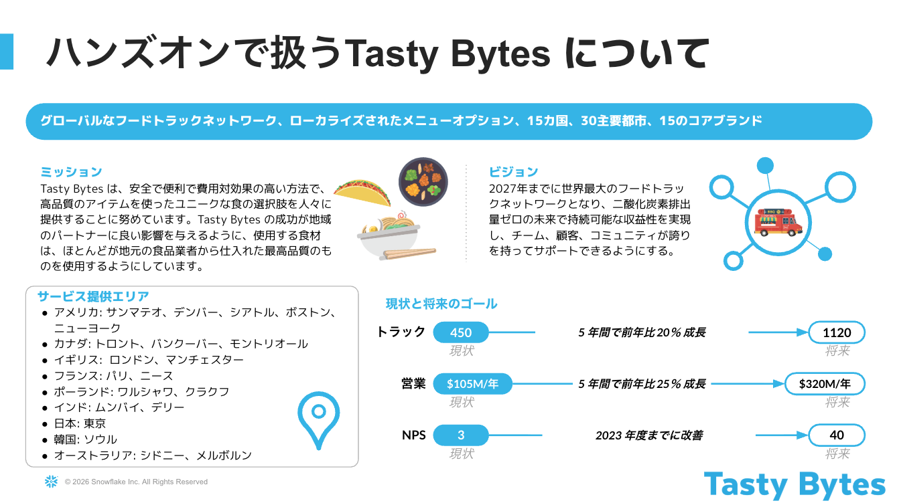

私たちのミッションは、地元ベンダーの新鮮な食材を重視しながら、便利でコスト効果の高い方法でユニークで高品質な食の選択肢を提供することです。そのビジョンは、カーボンフットプリントゼロで世界最大のフードトラックネットワークになることです。

### 前提条件

 - Snowflake のブラウザベースの Web Interface である Snowsight へアクセスできる [ブラウザ](https://docs.snowflake.com/ja/user-guide/setup?_fsi=6tNBra0z&_fsi=6tNBra0z#browser-requirements)
 - Wi-Fi に接続できる PC（会場では PC の貸し出しはありません）
 - 本ハンズオン専用のトライアルアカウント

本ハンズオンでは、**SWT 専用のサインアップ URL** から作成したトライアルアカウントを使用します。
以下のパラメータで作成してください。パラメータが異なると一部の手順が実行できません。

| 項目 | 指定値 |
| --- | --- |
| サインアップ URL | SWT 登録ページより展開されたサインアップ URL をご利用ください |
| Snowflake Edition | **Enterprise** |
| クラウドプロバイダー | **AWS** |
| リージョン | **US West (Oregon)**（選択できない場合は **Asia Pacific (Tokyo)**） |

> **Edition について:** 自動分類・マスキングポリシー・行アクセスポリシーを扱う「Horizon によるガバナンス」の章は Enterprise Edition 以上が必要です。Standard で作成すると当該章が実行できません。

> **サインアップ URL について:** URL は SWT 登録ページで展開されます。SWT 期間のみ有効な専用 URL のため、外部への共有はご遠慮ください。

アカウント作成後、届いたメールのアクティベーションリンクからユーザー名とパスワードを設定してください。

### 学習内容

  - **Vignette 1: Snowflake 入門:** 仮想ウェアハウス、キャッシュ、クローニング、タイムトラベルの基礎。
  - **Vignette 2: シンプルなデータパイプライン:** ダイナミックテーブルを使った半構造化データの取り込みと変換方法。
  - **Vignette 3: Horizon によるガバナンス:** ロール、分類、マスキング、行アクセスポリシーでデータを保護する方法。（オプションで Data Metric Function とトラストセンター）
  - **Vignette 4: Snowflake Cortex AI:** AI 関数によるレビュー分析と、Cortex Search / Semantic View / Cortex Agent を SQL で構築して会話型 BI を実現する方法。
  - **（オプション）Vignette 5: アプリとコラボレーション:** Snowflake マーケットプレイスを活用して、内部データをサードパーティデータセットで強化する方法。

> **本編は Vignette 1〜4 です。** 「（オプション）」と記した節・章は、時間に余裕がある場合またはハンズオン後にご自身のパースでお試しいただけます。

### 構築するもの

  - Snowflake コアプラットフォームの包括的な理解。
  - 設定済みの仮想ウェアハウス。
  - ダイナミックテーブルを使った自動化 ELT パイプライン。
  - Snowflake AI を活用した完全なインテリジェント顧客分析プラットフォーム。
  - ロールとポリシーを使った堅牢なデータガバナンスフレームワーク。
  - ファーストパーティとサードパーティのデータを組み合わせた強化された分析ビュー。

## セットアップ

### **概要**

このガイドでは、<a href="https://app.snowflake.com/_deeplink/#/workspaces?utm_source=snowflake-devrel&utm_medium=developer-guides&utm_content=zero-to-snowflake&utm_cta=developer-guides-deeplink" class="_deeplink">Snowflake Workspaces</a> を使用して、このコースに必要なすべての SQL スクリプトを整理・編集・実行します。セットアップ用と各ビネット用に専用の SQL ファイルを作成します。これによりコードが整理され、管理が容易になります。

最初の SQL ファイルの作成方法、必要なセットアップコードの追加方法、および実行方法を説明します。

> **実行順序に注意:** 必ず **ステップ 2 の `setup.sql` を先に実行**してから、ステップ 3 の Git ワークスペースを作成してください。`setup.sql` が Git 連携に必要な `GIT_API_INTEGRATION` を作成するため、順序を逆にするとワークスペース作成に失敗します。

### **ステップ 1 - セットアップ SQL ファイルの作成**

まず、セットアップスクリプトを置く場所が必要です。

1. **<a href="https://app.snowflake.com/_deeplink/#/workspaces?utm_source=snowflake-devrel&utm_medium=developer-guides&utm_content=zero-to-snowflake&utm_cta=developer-guides-deeplink" class="_deeplink">Workspaces</a> に移動:** Snowflake UI の左側ナビゲーションメニューで **Projects** » **<a href="https://app.snowflake.com/_deeplink/#/workspaces?utm_source=snowflake-devrel&utm_medium=developer-guides&utm_content=zero-to-snowflake-deeplink" class="_deeplink">Workspaces</a>** をクリックします。これがすべての SQL ファイルの中心的なハブです。
2. **新しい SQL ファイルの作成:** <a href="https://app.snowflake.com/_deeplink/#/workspaces?utm_source=snowflake-devrel&utm_medium=developer-guides&utm_content=zero-to-snowflake&utm_cta=developer-guides-deeplink" class="_deeplink">Workspaces</a> エリアの左上にある **+ Add New** ボタンを見つけてクリックし、**SQL File** を選択します。これにより新しい空の SQL ファイルが生成されます。
3. **SQL ファイルのリネーム:** 新しい SQL ファイルは作成されたタイムスタンプに基づく名前になっています。**Zero To Snowflake - Setup** などのわかりやすい名前を付けてください。

### **ステップ 2 - セットアップスクリプトの追加と実行**

SQL ファイルができたので、セットアップ SQL を追加して実行します。

1. **SQL コードのコピー:** **[セットアップファイル](https://github.com/sfc-gh-kshimada/ZeroToSnowflake-SWT2026-JA/blob/main/setup.sql)** のリンクをクリックし、クリップボードにコピーします。
2. **SQL ファイルへの貼り付け:** Snowflake の Zero To Snowflake Setup SQL ファイルに戻り、スクリプト全体をエディタに貼り付けます。
3. **スクリプトの実行:** SQL ファイル内のすべてのコマンドを順次実行するには、エディタ左上にある **「Run All」** ボタンをクリックします。これにより、以降のビネットに必要なロール、スキーマ、ウェアハウスの作成などのセットアップ処理がすべて実行されます。

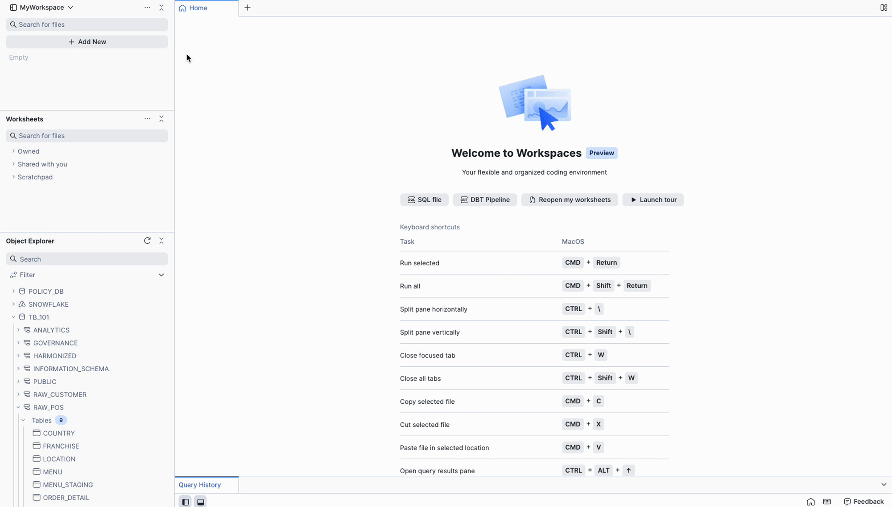

> **「∨」→「すべて実行 (Run All)」を使用してください。** 1 文ずつ実行すると途中で止まり、以降の章が動作しません。

### **ステップ 3 - Git ワークスペースの作成**

`setup.sql` の実行が完了したら、各章の SQL やデータをまとめて取得できるよう、このリポジトリを Git ワークスペースとしてリンクします。

1. Workspaces 画面上部の **+ Add New** をマウスオーバーして選択します。
2. 最下部の **Git Repository**（Git ワークスペース）を選択します。
3. 以下のパラメータを入力します。

| 項目 | 入力値 |
| --- | --- |
| リポジトリ URL | `https://github.com/sfc-gh-kshimada/ZeroToSnowflake-SWT2026-JA` |
| ワークスペース名 | `ZeroToSnowflake-SWT2026-JA` |
| API 統合 | `GIT_API_INTEGRATION` |
| アクセス | **パブリックリポジトリ** を選択 |

4. **作成** を選択します。リポジトリ内のファイルがワークスペースに表示されれば成功です。

このワークスペースを開くとリポジトリ同梱の `AGENTS.md` が自動的に読み込まれ、CoCo が本ハンズオンのオブジェクトを壊さないよう制御されます。

### **今後の作業について**

新しい SQL ファイルを作成するプロセスは、このコースの以降のすべてのビネットで使用するまったく同じワークフローです。

各新しいビネットでは以下を行います：

1. **新しい** SQL ファイルを作成する。
2. わかりやすい名前を付ける（例：Vignette 1 - Getting Started with Snowflake）。
3. そのビネット用の SQL スクリプトをコピーして貼り付ける。
4. 各 SQL ファイルには、手順に沿って進めるために必要なすべての指示とコマンドが含まれています。

<!-- end list -->

## Snowflake 入門


### 概要

このビネットでは、仮想ウェアハウスの探索、クエリ結果キャッシュの活用、基本的なデータ変換の実行、タイムトラベルによるデータリカバリの活用、リソースモニターとバジェットによるアカウントの監視を通じて、Snowflake のコアコンセプトを学びます。

### 学習内容
- 仮想ウェアハウスの作成、設定、スケーリング方法。
- クエリ結果キャッシュの活用方法。
- 開発用にゼロコピークローニングを使用する方法。
- データの変換とクリーニング方法。
- UNDROP を使用してドロップされたテーブルを即座に復元する方法。
- リソースモニターの作成と適用方法。
- コストを監視するためのバジェット作成方法。
- ユニバーサルサーチを使用してオブジェクトや情報を検索する方法。

### 構築するもの
- Snowflake 仮想ウェアハウス
- ゼロコピークローンを使用したテーブルの開発コピー
- リソースモニター
- バジェット

### SQL コードを取得して SQL ファイルに貼り付けます。

**この[ファイル](https://github.com/sfc-gh-kshimada/ZeroToSnowflake-SWT2026-JA/blob/main/scripts/vignette-1.sql)の SQL コードをコピーして、Snowflake の新しい SQL ファイルに貼り付けて進めてください。SQL ファイルの最後まで到達したら、ステップ 10 - シンプルなデータパイプラインにスキップできます。**

### 仮想ウェアハウスと設定


#### 概要

仮想ウェアハウスは、Snowflake データの分析を実行できる動的でスケーラブルかつコスト効果の高いコンピューティングパワーです。その目的は、基礎となる技術的な詳細を気にすることなく、すべてのデータ処理ニーズを処理することです。

#### ステップ 1 - コンテキストの設定

まず、セッションコンテキストを設定します。クエリを実行するには、SQL ファイル上部の 3 つのクエリをハイライトして「► Run」ボタンをクリックします。

```sql
ALTER SESSION SET query_tag = '{"origin":"sf_sit-is","name":"tb_zts","version":{"major":1, "minor":1},"attributes":{"is_quickstart":1, "source":"tastybytes", "vignette": "getting_started_with_snowflake"}}';

USE DATABASE tb_101;
USE ROLE accountadmin;
```

#### ステップ 2 - ウェアハウスの作成

最初のウェアハウスを作成しましょう！このコマンドは、最初はサスペンド状態の新しい X-Small ウェアハウスを作成します。

```sql
CREATE OR REPLACE WAREHOUSE my_wh
    COMMENT = 'My TastyBytes warehouse'
    WAREHOUSE_TYPE = 'standard'
    WAREHOUSE_SIZE = 'xsmall'
    MIN_CLUSTER_COUNT = 1
    MAX_CLUSTER_COUNT = 2
    SCALING_POLICY = 'standard'
    AUTO_SUSPEND = 60
    INITIALLY_SUSPENDED = true
    AUTO_RESUME = false;
```

> **仮想ウェアハウス**: 仮想ウェアハウス（単に「ウェアハウス」とも呼ばれます）は、Snowflake のコンピューティングリソースのクラスターです。ウェアハウスはクエリ、DML 操作、データロードに必要です。詳細については[ウェアハウスの概要](https://docs.snowflake.com/ja/user-guide/warehouses-overview)を参照してください。

#### ステップ 3 - ウェアハウスの使用と再開

ウェアハウスができたので、セッションのアクティブウェアハウスとして設定する必要があります。次のステートメントを実行します。

```sql
USE WAREHOUSE my_wh;
```

以下のクエリを実行しようとすると失敗します。ウェアハウスがサスペンド状態で、`AUTO_RESUME` が有効になっていないためです。
```sql
SELECT * FROM raw_pos.truck_details;
```

ウェアハウスを再開し、今後は自動再開するように設定しましょう。
```sql
ALTER WAREHOUSE my_wh RESUME;
ALTER WAREHOUSE my_wh SET AUTO_RESUME = TRUE;
```

もう一度クエリを試してください。今度は正常に実行されるはずです。

```sql
SELECT * FROM raw_pos.truck_details;
```

#### ステップ 4 - ウェアハウスのスケーリング

Snowflake のウェアハウスは弾力性を持つよう設計されています。より集中的なワークロードに対応するために、ウェアハウスをオンザフライでスケールアップできます。ウェアハウスを X-Large にスケールアップしましょう。

```sql
ALTER WAREHOUSE my_wh SET warehouse_size = 'XLarge';
```

> **補足 - Adaptive Warehouse（Public Preview）**: ウェアハウスサイズの選択が不要な Adaptive Warehouse が現在 Public Preview として提供されています。ワークロードに応じてコンピュートリソースを自動的に最適化するため、サイズ選択の手間がなくなります。詳細は[公式ドキュメント](https://docs.snowflake.com/ja/user-guide/warehouses-adaptive)および[参考記事](https://dev.classmethod.jp/articles/snowflake-try-adaptive-warehouse/)を参照してください。

より大きなウェアハウスで、トラックブランドごとの総売上を計算するクエリを実行しましょう。

```sql
SELECT
    o.truck_brand_name,
    COUNT(DISTINCT o.order_id) AS order_count,
    SUM(o.price) AS total_sales
FROM analytics.orders_v o
GROUP BY o.truck_brand_name
ORDER BY total_sales DESC;
```

### クエリ結果キャッシュ


#### 概要

ここは Snowflake のもう一つの強力な機能「クエリ結果キャッシュ」を示すのに最適な場所です。「トラックごとの売上」クエリを最初に実行したとき、数秒かかったかもしれません。まったく同じクエリを再度実行すると、結果はほぼ即座に返されます。これは、クエリ結果が Snowflake のクエリ結果キャッシュにキャッシュされているためです。

#### ステップ 1 - クエリの再実行

前のステップと同じ「トラックごとの売上」クエリを実行します。クエリ詳細ペインで実行時間に注目してください。大幅に速くなっているはずです。

```sql
SELECT
    o.truck_brand_name,
    COUNT(DISTINCT o.order_id) AS order_count,
    SUM(o.price) AS total_sales
FROM analytics.orders_v o
GROUP BY o.truck_brand_name
ORDER BY total_sales DESC;
```
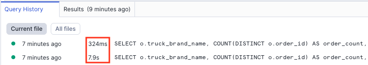

> **クエリ結果キャッシュ**: クエリの結果は 24 時間保持されます。結果キャッシュのヒットにはほとんどコンピューティングリソースが必要ないため、頻繁に実行されるレポートやダッシュボードに最適です。キャッシュはクラウドサービス層に存在し、アカウント内のすべてのユーザーとウェアハウスからグローバルにアクセス可能です。詳細については[永続化されたクエリ結果の使用に関するドキュメント](https://docs.snowflake.com/ja/user-guide/querying-persisted-results)を参照してください。

#### ステップ 2 - スケールダウン

これからは小さなデータセットを扱うため、クレジットを節約するためにウェアハウスを X-Small にスケールダウンできます。

```sql
ALTER WAREHOUSE my_wh SET warehouse_size = 'XSmall';
```

### 基本的な変換テクニック


#### 概要

このセクションでは、データをクリーンにするための基本的な変換テクニックと、開発環境を作成するためのゼロコピークローニングを紹介します。フードトラックのメーカーを分析することが目標ですが、このデータは現在 `VARIANT` カラム内にネストされています。

#### ステップ 1 - ゼロコピークローンを使った開発テーブルの作成

まず `truck_build` カラムを確認しましょう。
```sql
SELECT truck_build FROM raw_pos.truck_details;
```
このテーブルには各トラックのメーカー、モデル、年式のデータが含まれていますが、VARIANT と呼ばれる特殊なデータ型にネスト（埋め込み）されています。このカラムに対して操作を実行してこれらの値を抽出できますが、まず開発用コピーを作成します。

`truck_details` テーブルの開発コピーを作成しましょう。Snowflake のゼロコピークローニングを使うと、追加ストレージを使用せずに即座にテーブルの完全な独立コピーを作成できます。

```sql
CREATE OR REPLACE TABLE raw_pos.truck_dev CLONE raw_pos.truck_details;
```

> **[ゼロコピークローニング](https://docs.snowflake.com/ja/user-guide/object-clone)**: クローニングはストレージを複製せずにデータベースオブジェクトのコピーを作成します。オリジナルまたはクローンのどちらかに加えられた変更は新しいマイクロパーティションとして保存され、もう一方のオブジェクトには影響しません。

#### ステップ 2 - 新しいカラムの追加とデータの変換

安全な開発テーブルができたので、`year`、`make`、`model` のカラムを追加します。次に、`truck_build` の `VARIANT` カラムからデータを抽出して新しいカラムに入力します。

```sql
-- 新しいカラムを追加
ALTER TABLE raw_pos.truck_dev ADD COLUMN IF NOT EXISTS year NUMBER;
ALTER TABLE raw_pos.truck_dev ADD COLUMN IF NOT EXISTS make VARCHAR(255);
ALTER TABLE raw_pos.truck_dev ADD COLUMN IF NOT EXISTS model VARCHAR(255);

-- データを抽出して更新
UPDATE raw_pos.truck_dev
SET 
    year = truck_build:year::NUMBER,
    make = truck_build:make::VARCHAR,
    model = truck_build:model::VARCHAR;
```

#### ステップ 3 - データのクリーニング

トラックメーカーの分布を確認するクエリを実行しましょう。

```sql
SELECT 
    make,
    COUNT(*) AS count
FROM raw_pos.truck_dev
GROUP BY make
ORDER BY make ASC;
```

最後のクエリの結果に何か奇妙なことに気づきましたか？データ品質の問題が確認できます。「Ford」と「Ford_」が別々のメーカーとして扱われています。シンプルな `UPDATE` ステートメントでこれを簡単に修正しましょう。

```sql
UPDATE raw_pos.truck_dev
    SET make = 'Ford'
    WHERE make = 'Ford_';
```
ここでは、make の値が `Ford_` の行を `Ford` に設定することを指定しています。これにより、Ford のメーカーにアンダースコアが付かなくなり、統一されたメーカー数が得られます。

#### ステップ 4 - SWAP を使った本番環境へのプロモート

開発テーブルがクリーンになり、正しくフォーマットされました。`SWAP WITH` コマンドを使って、即座に新しい本番テーブルとしてプロモートできます。これにより 2 つのテーブルがアトミックに入れ替えられます。

```sql
ALTER TABLE raw_pos.truck_details SWAP WITH raw_pos.truck_dev;
```

#### ステップ 5 - クリーンアップ

スワップが完了したので、新しい本番テーブルから不要な `truck_build` カラムをドロップできます。また、現在 `truck_dev` という名前になっている古い本番テーブルもドロップする必要があります。ただし、次のレッスンのために、メインテーブルを「誤って」ドロップします。

```sql
ALTER TABLE raw_pos.truck_details DROP COLUMN truck_build;

-- 誤って本番テーブルをドロップ！
DROP TABLE raw_pos.truck_details;
```

#### ステップ 6 - UNDROP によるデータリカバリ

大変です！誤って本番テーブル `truck_details` をドロップしてしまいました。幸い、Snowflake のタイムトラベル機能により即座に復元できます。`UNDROP` コマンドはドロップされたオブジェクトを復元します。

#### ステップ 7 - ドロップの確認

テーブルに対して `DESCRIBE` コマンドを実行すると、存在しないというエラーが表示されます。

```sql
DESCRIBE TABLE raw_pos.truck_details;
```

#### ステップ 8 - UNDROP でテーブルを復元

`truck_details` テーブルをドロップ前の状態に復元しましょう。

```sql
UNDROP TABLE raw_pos.truck_details;
```

> **[タイムトラベルと UNDROP](https://docs.snowflake.com/ja/user-guide/data-time-travel)**: Snowflake タイムトラベルは、定義された期間内の任意の時点での過去データへのアクセスを可能にします。これにより、変更または削除されたデータを復元できます。`UNDROP` はタイムトラベルの機能で、誤ってドロップした場合の復旧を簡単にします。

#### ステップ 9 - 復元の確認とクリーンアップ

テーブルが正常に復元されたことを SELECT で確認します。その後、実際の開発テーブル `truck_dev` を安全にドロップできます。

```sql
-- テーブルが復元されたことを確認
SELECT * from raw_pos.truck_details;

-- 実際の truck_dev テーブルをドロップ
DROP TABLE raw_pos.truck_dev;
```

### リソースモニター


#### 概要

コンピューティング使用量の監視は重要です。Snowflake はウェアハウスのクレジット使用量を追跡するリソースモニターを提供しています。クレジットクォータを定義し、しきい値に達したときにアクション（通知やサスペンドなど）をトリガーできます。

#### ステップ 1 - リソースモニターの作成

`my_wh` 用のリソースモニターを作成しましょう。このモニターは月間クォータ 100 クレジットで、クォータの 75% で通知を送信し、90% と 100% でウェアハウスをサスペンドします。まず、ロールが `accountadmin` であることを確認してください。

```sql
USE ROLE accountadmin;

CREATE OR REPLACE RESOURCE MONITOR my_resource_monitor
    WITH CREDIT_QUOTA = 100
    FREQUENCY = MONTHLY
    START_TIMESTAMP = IMMEDIATELY
    TRIGGERS ON 75 PERCENT DO NOTIFY
             ON 90 PERCENT DO SUSPEND
             ON 100 PERCENT DO SUSPEND_IMMEDIATE;
```

#### ステップ 2 - リソースモニターの適用

モニターが作成されたので、`my_wh` に適用します。

```sql
ALTER WAREHOUSE my_wh 
    SET RESOURCE_MONITOR = my_resource_monitor;
```

> 各設定の詳細については、[リソースモニターの操作に関するドキュメント](https://docs.snowflake.com/ja/user-guide/resource-monitors)を参照してください。

### バジェットの作成


#### 概要

リソースモニターがウェアハウスの使用量を追跡する一方、バジェットはすべての Snowflake コストを管理するより柔軟なアプローチを提供します。バジェットは任意の Snowflake オブジェクトの支出を追跡し、ドル金額のしきい値に達したときにユーザーに通知できます。

#### ステップ 1 - SQL でバジェットを作成

まず、SQL でバジェットオブジェクトを作成します。

```sql
CREATE OR REPLACE SNOWFLAKE.CORE.BUDGET my_budget()
    COMMENT = 'My Tasty Bytes Budget';
```

#### ステップ 2 - Snowsight のバジェットページ
Snowsight のバジェットページを確認しましょう。

**Admin** » **Cost Management** » **Budgets** に移動します。

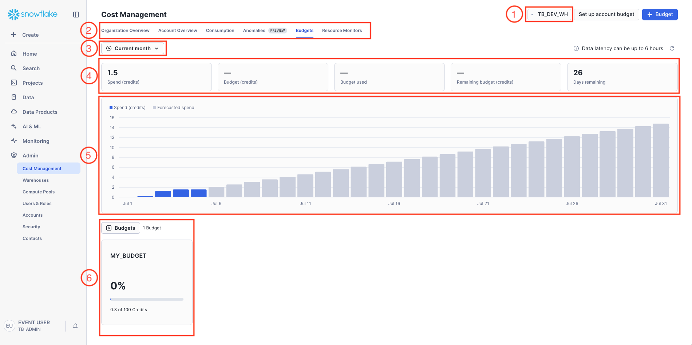

**凡例:**
1. ウェアハウスコンテキスト
2. コスト管理ナビゲーション
3. 期間フィルター
4. 主要指標サマリー
5. 支出と予測トレンドチャート
6. バジェットの詳細

#### ステップ 3 - Snowsight でのバジェット設定

バジェットの設定は Snowsight の UI から行います。

1.  アカウントロールが `ACCOUNTADMIN` に設定されていることを確認します。左下隅で変更できます。
2.  作成した **MY_BUDGET** バジェットをクリックします。
3.  **Budget Details** をクリックしてバジェット詳細パネルを開き、右側のバジェット詳細パネルで **Edit** をクリックします。
4.  **Spending Limit** を `100` に設定します。
5.  確認済みの通知メールアドレスを入力します。
6.  **+ Tags & Resources** をクリックし、監視対象として **TB_101.ANALYTICS** スキーマと **TB_DE_WH** ウェアハウスを追加します。
7.  **Save Changes** をクリックします。
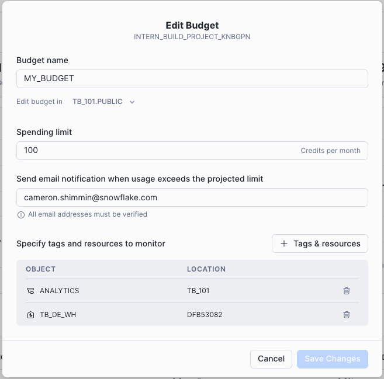

> バジェットの詳細なガイドについては、[Snowflake バジェットドキュメント](https://docs.snowflake.com/ja/user-guide/budgets)を参照してください。

### ユニバーサルサーチ


#### 概要

ユニバーサルサーチを使うと、アカウント内の任意のオブジェクトを簡単に見つけ、マーケットプレイスのデータ製品、関連する Snowflake ドキュメント、コミュニティナレッジベースの記事を探索できます。

#### ステップ 1 - オブジェクトの検索

試してみましょう。

1.  左側のナビゲーションメニューで **Search** をクリックします。
2.  検索バーに `truck` と入力します。
3.  結果を確認します。テーブルやビューなどのアカウント上のオブジェクトのカテゴリと、関連するドキュメントが表示されます。

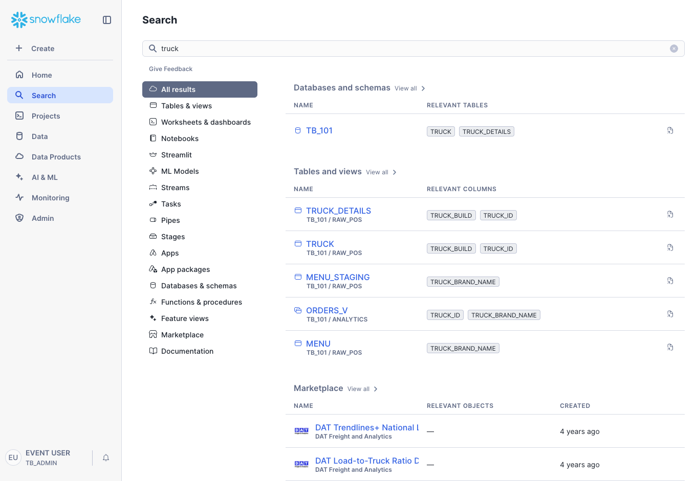

#### ステップ 2 - 自然言語検索の使用

自然言語も使用できます。例えば、`Which truck franchise has the most loyal customer base?`（どのトラックフランチャイズが最も忠実な顧客基盤を持っていますか？）を検索してみてください。
ユニバーサルサーチは、質問への回答に役立つ可能性のあるカラムをハイライトしながら関連するテーブルやビューを返し、分析の優れた出発点を提供します。

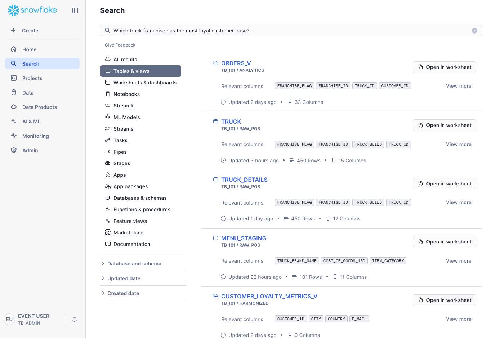

## シンプルなデータパイプライン


### 概要

このビネットでは、Snowflake でシンプルな自動化データパイプラインを構築する方法を学びます。外部ステージから生の半構造化データを取り込むところから始まり、Snowflake のダイナミックテーブルの力を使ってそのデータを変換・強化し、新しいデータが到着すると自動的に最新状態を保つパイプラインを作成します。

### 学習内容
- 外部 S3 ステージからデータを取り込む方法。
- 半構造化 VARIANT データのクエリと変換方法。
- 配列を解析するための FLATTEN 関数の使用方法。
- ダイナミックテーブルの作成と連鎖方法。
- ELT パイプラインが新しいデータを自動的に処理する仕組み。
- 有向非巡回グラフ（DAG）を使ったパイプラインの可視化方法。

### 構築するもの
- データ取り込み用の外部ステージ。
- 生データ用のステージングテーブル。
- 3 つの連鎖したダイナミックテーブルを使ったマルチステップデータパイプライン。

### SQL を取得して SQL ファイルに貼り付けます。

**この[ファイル](https://github.com/sfc-gh-kshimada/ZeroToSnowflake-SWT2026-JA/blob/main/scripts/vignette-2-1.sql)の SQL を新しい SQL ファイルにコピーして貼り付け、Snowflake で手順に沿って進めてください。SQL ファイルの最後まで到達したら、ステップ 16 - Snowflake Cortex AI にスキップできます。**

### 外部ステージの取り込み


#### 概要

生のメニューデータは現在、CSV ファイルとして Amazon S3 バケットに保存されています。パイプラインを開始するには、まずこのデータを Snowflake に取り込む必要があります。S3 バケットを指すステージを作成し、`COPY` コマンドを使ってデータをステージングテーブルにロードします。

#### ステップ 1 - コンテキストの設定

まず、正しいデータベース、ロール、ウェアハウスを使用するようにセッションコンテキストを設定します。SQL ファイルの最初のいくつかのクエリを実行します。

```sql
ALTER SESSION SET query_tag = '{"origin":"sf_sit-is","name":"tb_zts","version":{"major":1, "minor":1},"attributes":{"is_quickstart":1, "source":"tastybytes", "vignette": "data_pipeline"}}';

USE DATABASE tb_101;
USE ROLE tb_data_engineer;
USE WAREHOUSE tb_de_wh;
```

#### ステップ 2 - ステージとステージングテーブルの作成

ステージは外部データファイルが保存されている場所を指定する Snowflake オブジェクトです。パブリック S3 バケットを指すステージを作成します。次に、この生データを保持するテーブルを作成します。

```sql
-- メニューステージを作成
CREATE OR REPLACE STAGE raw_pos.menu_stage
COMMENT = 'Stage for menu data'
URL = 's3://sfquickstarts/frostbyte_tastybytes/raw_pos/menu/'
FILE_FORMAT = public.csv_ff;

CREATE OR REPLACE TABLE raw_pos.menu_staging
(
    menu_id NUMBER(19,0),
    menu_type_id NUMBER(38,0),
    menu_type VARCHAR(16777216),
    truck_brand_name VARCHAR(16777216),
    menu_item_id NUMBER(38,0),
    menu_item_name VARCHAR(16777216),
    item_category VARCHAR(16777216),
    item_subcategory VARCHAR(16777216),
    cost_of_goods_usd NUMBER(38,4),
    sale_price_usd NUMBER(38,4),
    menu_item_health_metrics_obj VARIANT
);
```

#### ステップ 3 - ステージングテーブルへのデータコピー

ステージとテーブルが準備できたので、`COPY INTO` コマンドを使ってステージから `menu_staging` テーブルにデータをロードしましょう。

```sql
COPY INTO raw_pos.menu_staging
FROM @raw_pos.menu_stage;
```

> 
> **[COPY INTO TABLE](https://docs.snowflake.com/ja/sql-reference/sql/copy-into-table)**: この強力なコマンドはステージされたファイルから Snowflake テーブルにデータをロードします。これは一括データ取り込みの主要な方法です。

### 半構造化データ


#### 概要

Snowflake はネイティブの `VARIANT` データ型を使用して JSON などの半構造化データの処理に優れています。取り込んだカラムの 1 つ `menu_item_health_metrics_obj` には JSON が含まれています。クエリ方法を探ってみましょう。

#### ステップ 1 - VARIANT データのクエリ

生の JSON を見てみましょう。ネストされたオブジェクトと配列が含まれています。

```sql
SELECT menu_item_health_metrics_obj FROM raw_pos.menu_staging;
```

特別な構文を使って JSON 構造をナビゲートできます。コロン（`:`）は名前でキーにアクセスし、角括弧（`[]`）はインデックスで配列要素にアクセスします。`CAST` 関数またはダブルコロン（`::`）の省略記法を使って結果を明示的なデータ型にキャストすることもできます。

```sql
SELECT
    menu_item_name,
    CAST(menu_item_health_metrics_obj:menu_item_id AS INTEGER) AS menu_item_id, -- 'AS' を使ったキャスト
    menu_item_health_metrics_obj:menu_item_health_metrics[0]:ingredients::ARRAY AS ingredients -- ダブルコロン (::) 構文を使ったキャスト
FROM raw_pos.menu_staging;
```

#### ステップ 2 - FLATTEN を使った配列の解析

`FLATTEN` 関数は配列をアンネストするための強力なツールです。配列内の各要素に対して新しい行を生成します。すべてのメニュー項目のすべての食材のリストを作成するために使用してみましょう。

```sql
SELECT
    i.value::STRING AS ingredient_name,
    m.menu_item_health_metrics_obj:menu_item_id::INTEGER AS menu_item_id
FROM
    raw_pos.menu_staging m,
    LATERAL FLATTEN(INPUT => m.menu_item_health_metrics_obj:menu_item_health_metrics[0]:ingredients::ARRAY) i;
```

> 
> **[半構造化データ型](https://docs.snowflake.com/ja/sql-reference/data-types-semistructured)**: Snowflake の VARIANT、OBJECT、ARRAY 型を使用すると、厳密なスキーマを事前に定義することなく、半構造化データを直接保存してクエリできます。

### ダイナミックテーブル


#### 概要

フランチャイズは常に新しいメニュー項目を追加しています。この新しいデータを自動的に処理する方法が必要です。そのために、クエリの結果を宣言的に定義し、Snowflake がリフレッシュを処理することでデータ変換パイプラインを簡素化するよう設計された強力なツール「ダイナミックテーブル」を使用できます。

#### ステップ 1 - 最初のダイナミックテーブルの作成

ステージングテーブルからすべてのユニークな食材を抽出するダイナミックテーブルを作成することから始めます。`LAG` を「1 分」に設定します。これにより、このテーブルのデータがソースデータから遅れることができる最大時間が Snowflake に伝えられます。

```sql
CREATE OR REPLACE DYNAMIC TABLE harmonized.ingredient
    LAG = '1 minute'
    WAREHOUSE = 'TB_DE_WH'
AS
    SELECT
    ingredient_name,
    menu_ids
FROM (
    SELECT DISTINCT
        i.value::STRING AS ingredient_name, 
        ARRAY_AGG(m.menu_item_id) AS menu_ids
    FROM
        raw_pos.menu_staging m,
        LATERAL FLATTEN(INPUT => menu_item_health_metrics_obj:menu_item_health_metrics[0]:ingredients::ARRAY) i
    GROUP BY i.value::STRING
);
```

> 
> **[ダイナミックテーブル](https://docs.snowflake.com/ja/user-guide/dynamic-tables-about)**: ダイナミックテーブルは、基礎となるソースデータが変更されると自動的にリフレッシュされ、手動介入や複雑なスケジューリングなしに ELT パイプラインを簡素化してデータの新鮮さを確保します。

#### ステップ 2 - 自動リフレッシュのテスト

自動化を実際に確認しましょう。あるトラックが新しい食材（フランスバゲットとピクルス大根）を含むバインミーサンドイッチを追加しました。この新しいメニュー項目をステージングテーブルに挿入しましょう。

```sql
INSERT INTO raw_pos.menu_staging 
SELECT 
    10101, 15, 'Sandwiches', 'Better Off Bread', 157, 'Banh Mi', 'Main', 'Cold Option', 9.0, 12.0,
    PARSE_JSON('{"menu_item_health_metrics": [{"ingredients": ["French Baguette","Mayonnaise","Pickled Daikon","Cucumber","Pork Belly"],"is_dairy_free_flag": "N","is_gluten_free_flag": "N","is_healthy_flag": "Y","is_nut_free_flag": "Y"}],"menu_item_id": 157}');
```

`harmonized.ingredient` テーブルをクエリします。1 分以内に新しい食材が自動的に表示されるはずです。

```sql
-- 最大 1 分待ってからこのクエリを再実行する必要がある場合があります
SELECT * FROM harmonized.ingredient 
WHERE ingredient_name IN ('French Baguette', 'Pickled Daikon');
```

### パイプラインの構築


#### 概要

他のダイナミックテーブルから読み取るダイナミックテーブルをさらに作成することで、マルチステップパイプラインを構築できます。これにより、ソースから最終出力まで更新が自動的に流れるチェーン（有向非巡回グラフ＝DAG）が作成されます。

#### ステップ 1 - ルックアップテーブルの作成

食材をそれが使用されているメニュー項目にマッピングするルックアップテーブルを作成しましょう。このダイナミックテーブルは `harmonized.ingredient` ダイナミックテーブルから読み取ります。

```sql
CREATE OR REPLACE DYNAMIC TABLE harmonized.ingredient_to_menu_lookup
    LAG = '1 minute'
    WAREHOUSE = 'TB_DE_WH'   
AS
SELECT
    i.ingredient_name,
    m.menu_item_health_metrics_obj:menu_item_id::INTEGER AS menu_item_id
FROM
    raw_pos.menu_staging m,
    LATERAL FLATTEN(INPUT => m.menu_item_health_metrics_obj:menu_item_health_metrics[0]:ingredients) f
JOIN harmonized.ingredient i ON f.value::STRING = i.ingredient_name;
```

#### ステップ 2 - トランザクションデータの追加

注文テーブルにレコードを挿入して、バインミーサンドイッチ 2 つの注文をシミュレートしましょう。

```sql
INSERT INTO raw_pos.order_header
SELECT 
    459520441, 15, 1030, 101565, null, 200322900,
    TO_TIMESTAMP_NTZ('08:00:00', 'hh:mi:ss'),
    TO_TIMESTAMP_NTZ('14:00:00', 'hh:mi:ss'),
    null, TO_TIMESTAMP_NTZ('2022-01-27 08:21:08.000'),
    null, 'USD', 14.00, null, null, 14.00;
    
INSERT INTO raw_pos.order_detail
SELECT
    904745311, 459520441, 157, null, 0, 2, 14.00, 28.00, null;
```

#### ステップ 3 - 最終パイプラインテーブルの作成

最後に、最終のダイナミックテーブルを作成します。これは注文データと食材ルックアップテーブルを結合して、トラックごとの月次食材使用量のサマリーを作成します。このテーブルは他のダイナミックテーブルに依存しており、パイプラインを完成させます。

```sql
CREATE OR REPLACE DYNAMIC TABLE harmonized.ingredient_usage_by_truck 
    LAG = '2 minute'
    WAREHOUSE = 'TB_DE_WH'  
    AS 
    SELECT
        oh.truck_id,
        EXTRACT(YEAR FROM oh.order_ts) AS order_year,
        MONTH(oh.order_ts) AS order_month,
        i.ingredient_name,
        SUM(od.quantity) AS total_ingredients_used
    FROM
        raw_pos.order_detail od
        JOIN raw_pos.order_header oh ON od.order_id = oh.order_id
        JOIN harmonized.ingredient_to_menu_lookup iml ON od.menu_item_id = iml.menu_item_id
        JOIN harmonized.ingredient i ON iml.ingredient_name = i.ingredient_name
        JOIN raw_pos.location l ON l.location_id = oh.location_id
    WHERE l.country = 'United States'
    GROUP BY
        oh.truck_id,
        order_year,
        order_month,
        i.ingredient_name
    ORDER BY
        oh.truck_id,
        total_ingredients_used DESC;
```

#### ステップ 4 - 最終出力のクエリ

パイプラインの最終テーブルをクエリしましょう。リフレッシュが完了するまで数分待つと、前のステップで挿入した注文のバインミー 2 つの食材使用量が表示されます。パイプライン全体が自動的に更新されました。

```sql
-- 最大 2 分待ってからこのクエリを再実行する必要がある場合があります
SELECT
    truck_id,
    ingredient_name,
    SUM(total_ingredients_used) AS total_ingredients_used
FROM
    harmonized.ingredient_usage_by_truck
WHERE
    order_month = 1
    AND truck_id = 15
GROUP BY truck_id, ingredient_name
ORDER BY total_ingredients_used DESC;
```

### パイプラインの可視化


#### 概要

最後に、パイプラインの有向非巡回グラフ（DAG）を可視化しましょう。DAG はデータがテーブルを通じてどのように流れるかを示し、パイプラインの健全性とラグを監視するために使用できます。

#### ステップ 1 - グラフビューへのアクセス

Snowsight で DAG にアクセスするには：

1.  **Data** » **Database** に移動します。
2.  データベースオブジェクトエクスプローラーで、データベース **TB_101** とスキーマ **HARMONIZED** を展開します。
3.  **Dynamic Tables** をクリックします。
4.  作成したダイナミックテーブルのいずれか（例：`INGREDIENT_USAGE_BY_TRUCK`）を選択します。
5.  メインウィンドウの **Graph** タブをクリックします。

パイプラインの可視化が表示され、ベーステーブルからダイナミックテーブルへのデータフローが示されます。

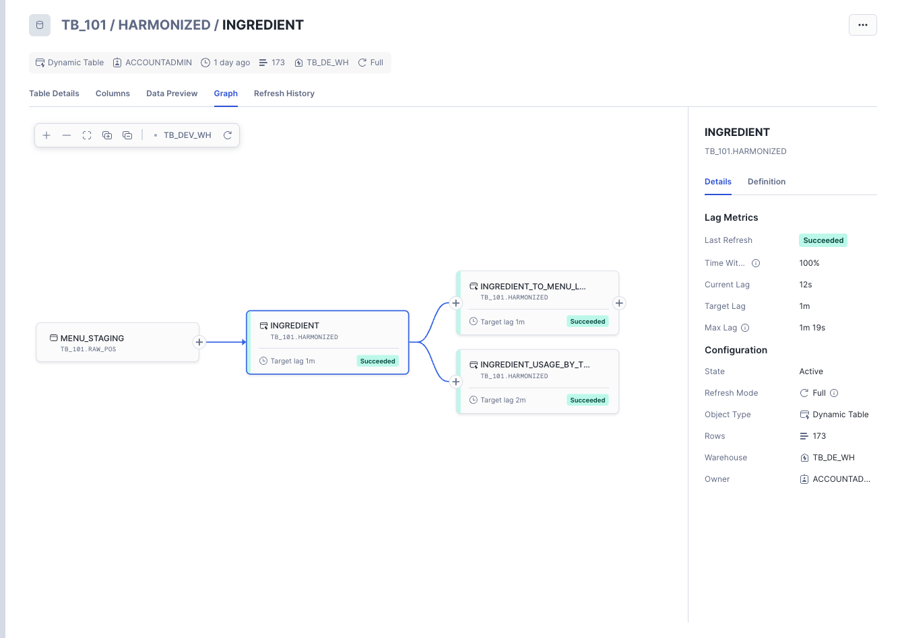

## CoCo in Snowsight でパイプラインを作ってみる（任意）

### 概要

Snowflake には Snowsight に統合された AI エージェント **CoCo (Cortex Code)** があります。自然言語のプロンプトから SQL の作成・実行までを行えます。このセクションは任意ですが、先ほど Vignette 2 で体験したダイナミックテーブルのパイプラインを、今度は自分でゼロから CoCo に作らせてみましょう。

このハンズオン専用に、既存のデータや設定に影響を与えない隔離スキーマ `tb_101.coco_handson` を用意しています。CoCo にはこのスキーマの中だけで自由に作業してもらうので、他の Vignette の内容を壊す心配はありません。

> **安全に試せる理由：** CoCo は `CREATE`・`INSERT`・`DROP` などの書き込み系 SQL を実行する前に必ず確認ダイアログを表示します（「今回のみ許可」「このチャットでは常に許可」などを選択可能）。またこのリポジトリには `AGENTS.md` というガードレールファイルが含まれており、CoCo に対して「`tb_101.coco_handson` 以外のオブジェクトは変更・削除しない」ことを指示しています。Git 連携済みのワークスペースとしてこのリポジトリを開くと（**Projects** » **Workspaces** » **+ Add New** » **Git Repository** から `https://github.com/sfc-gh-kshimada/ZeroToSnowflake-SWT2026-JA` を指定）、`AGENTS.md` が自動的に読み込まれます。通常のワークシートで試す場合でも、上記の確認ダイアログにより誤操作は防止されます。

### 手順を取得します。

**この[ファイル](https://github.com/sfc-gh-kshimada/ZeroToSnowflake-SWT2026-JA/blob/main/scripts/vignette-2-2.md)の手順に沿って、Snowsight の CoCo (Cortex Code) パネルで進めてください。SQL ファイルは不要です。完了したら、ステップ 16 - Snowflake Cortex AI にスキップできます。**

## Horizon によるガバナンス


### 概要

このビネットでは、Snowflake Horizon の強力なガバナンス機能のいくつかを探ります。ロールベースのアクセス制御（RBAC）の確認から始まり、自動データ分類、カラムレベルセキュリティのためのタグベースのマスキングポリシー、行アクセスポリシー、タグ伝播による下流オブジェクトへの自動ガバナンス継承、データ品質モニタリング、そして最後にトラストセンターによるアカウント全体のセキュリティ監視まで学びます。

### 学習内容
- Snowflake でのロールベースのアクセス制御（RBAC）の基礎。
- 機密データを自動的に分類してタグ付けする方法。
- ダイナミックデータマスキングによるカラムレベルセキュリティの実装方法。
- 行アクセスポリシーによる行レベルセキュリティの実装方法。
- タグ伝播（Tag Propagation）でビューや派生テーブルにガバナンスを自動継承させる方法。
- （オプション）Data Metric Function でデータ品質をチェックする方法。
- （オプション）トラストセンターによるアカウントセキュリティの監視方法。

### 構築するもの
- カスタムの特権ロール（`tb_data_steward`）。
- PII の自動タグ付けのためのデータ分類プロファイル。
- `PROPAGATE` 設定済みの PII タグと、文字列・日付カラム用のタグベースマスキングポリシー。
- 国別にデータの可視性を制限する行アクセスポリシー。
- 上流テーブルからタグ・ポリシーが自動伝播する下流ビュー。
- （オプション）業務ルール違反を検出するカスタム Data Metric Function。

### SQL コードを取得して SQL ファイルに貼り付けます。

**この[ファイル](https://github.com/sfc-gh-kshimada/ZeroToSnowflake-SWT2026-JA/blob/main/scripts/vignette-3.sql)の SQL を新しい SQL ファイルにコピーして貼り付け、Snowflake で手順に沿って進めてください。**

> **章の構成:** セクション 1〜4（RBAC / 分類 / マスキング / 行アクセスポリシー）が必須です。セクション 5（Data Metric Function）とセクション 6（トラストセンター）は時間に余裕がある場合のオプションです。

### ロールとアクセス制御


#### 概要

Snowflake のセキュリティモデルは、ロールベースのアクセス制御（RBAC）と裁量的アクセス制御（DAC）のフレームワークに基づいています。アクセス権限はロールに割り当てられ、そのロールがユーザーに割り当てられます。これによりオブジェクトのセキュリティ保護のための強力で柔軟な階層が作成されます。

> 
> **[アクセス制御の概要](https://docs.snowflake.com/ja/user-guide/security-access-control-overview)**: セキュアなオブジェクト、ロール、権限、ユーザーを含む Snowflake のアクセス制御の主要概念の詳細については、こちらを参照してください。

#### ステップ 1 - コンテキストの設定と既存ロールの確認

まず、この演習のコンテキストを設定し、アカウントに既存するロールを確認しましょう。

```sql
USE ROLE useradmin;
USE DATABASE tb_101;
USE WAREHOUSE tb_dev_wh;

SHOW ROLES;
```

#### ステップ 2 - カスタムロールの作成

カスタムの `tb_data_steward` ロールを作成します。このロールは顧客データの管理と保護を担当します。

```sql
CREATE OR REPLACE ROLE tb_data_steward
    COMMENT = 'Custom Role';
```

システムロールとカスタムロールの典型的な階層は次のようになります：

```
                                +---------------+
                                | ACCOUNTADMIN  |
                                +---------------+
                                  ^    ^     ^
                                  |    |     |
                    +-------------+-+  |    ++-------------+
                    | SECURITYADMIN |  |    |   SYSADMIN   |<------------+
                    +---------------+  |    +--------------+             |
                            ^          |     ^        ^                  |
                            |          |     |        |                  |
                    +-------+-------+  |     |  +-----+-------+  +-------+-----+
                    |   USERADMIN   |  |     |  | CUSTOM ROLE |  | CUSTOM ROLE |
                    +---------------+  |     |  +-------------+  +-------------+
                            ^          |     |      ^              ^      ^
                            |          |     |      |              |      |
                            |          |     |      |              |    +-+-----------+
                            |          |     |      |              |    | CUSTOM ROLE |
                            |          |     |      |              |    +-------------+
                            |          |     |      |              |           ^
                            |          |     |      |              |           |
                            +----------+-----+---+--+--------------+-----------+
                                                 |
                                            +----+-----+
                                            |  PUBLIC  |
                                            +----------+
```
Snowflake システム定義ロールの定義：

- **ORGADMIN**: 組織レベルの操作を管理するロール。
- **ACCOUNTADMIN**: システムの最上位ロールで、アカウント内の限られた/管理されたユーザーにのみ付与する必要があります。
- **SECURITYADMIN**: グローバルに任意のオブジェクト付与を管理し、ユーザーとロールを作成・監視・管理できるロール。
- **USERADMIN**: ユーザーとロールの管理専用のロール。
- **SYSADMIN**: アカウントでウェアハウスとデータベースを作成する権限を持つロール。
- **PUBLIC**: すべてのユーザーとロールに自動的に付与される疑似ロール。セキュアなオブジェクトを所有でき、所有するものはアカウントの他のすべてのユーザーとロールが利用できます。

#### ステップ 3 - カスタムロールへの権限付与

権限を付与しないとロールでは何もできません。`securityadmin` ロールに切り替えて、新しい `tb_data_steward` ロールにウェアハウスの使用とデータベーススキーマおよびテーブルへのアクセスに必要な権限を付与しましょう。

```sql
USE ROLE securityadmin;

-- ウェアハウス使用権限を付与
GRANT OPERATE, USAGE ON WAREHOUSE tb_dev_wh TO ROLE tb_data_steward;

-- データベースとスキーマの使用権限を付与
GRANT USAGE ON DATABASE tb_101 TO ROLE tb_data_steward;
GRANT USAGE ON ALL SCHEMAS IN DATABASE tb_101 TO ROLE tb_data_steward;

-- テーブルレベルの権限を付与
GRANT SELECT ON ALL TABLES IN SCHEMA raw_customer TO ROLE tb_data_steward;
GRANT ALL ON SCHEMA governance TO ROLE tb_data_steward;
GRANT ALL ON ALL TABLES IN SCHEMA governance TO ROLE tb_data_steward;
```

#### ステップ 4 - 新しいロールの付与と使用

最後に、自分自身のユーザーに新しいロールを付与します。その後、`tb_data_steward` ロールに切り替えてクエリを実行し、アクセスできるデータを確認できます。

```sql
-- 自分のユーザーにロールを付与
SET my_user = CURRENT_USER();
GRANT ROLE tb_data_steward TO USER IDENTIFIER($my_user);

-- 新しいロールに切り替え
USE ROLE tb_data_steward;

-- テストクエリを実行
SELECT TOP 100 * FROM raw_customer.customer_loyalty;
```

クエリ結果を見ると、このテーブルに多くの個人識別情報（PII）が含まれていることがわかります。次のセクションでその保護方法を学びます。

### 分類と自動タグ付け


#### 概要

データガバナンスの重要な最初のステップは、機密データの特定と分類です。Snowflake Horizon の自動タグ付け機能は、スキーマ内のカラムを監視して機密情報を自動的に検出します。これらのタグを使用してセキュリティポリシーを適用できます。

> 
> **[自動分類](https://docs.snowflake.com/ja/user-guide/classify-auto)**: Snowflake がスケジュールに基づいて機密データを自動的に分類し、スケールでのガバナンスを簡素化する方法を学びます。

#### ステップ 1 - PII タグの作成と権限付与

`accountadmin` ロールを使って、`governance` スキーマに `pii` タグを作成します。タグ作成時に `PROPAGATE = ON_DEPENDENCY_AND_DATA_MOVEMENT` を指定することで、下流ビューや CTAS 派生テーブルにもタグが自動伝播するようになります（Enterprise Edition 以上）。また、`tb_data_steward` ロールに分類を実行するために必要な権限を付与します。

```sql
USE ROLE accountadmin;

-- PROPAGATE 設定でタグを作成（依存オブジェクトとデータ移動の双方に伝播）
CREATE OR REPLACE TAG governance.pii
    ALLOWED_VALUES 'TRUE', 'FALSE'
    PROPAGATE = ON_DEPENDENCY_AND_DATA_MOVEMENT;

GRANT APPLY TAG ON ACCOUNT TO ROLE tb_data_steward;
GRANT EXECUTE AUTO CLASSIFICATION ON SCHEMA raw_customer TO ROLE tb_data_steward;
GRANT DATABASE ROLE SNOWFLAKE.CLASSIFICATION_ADMIN TO ROLE tb_data_steward;
GRANT CREATE SNOWFLAKE.DATA_PRIVACY.CLASSIFICATION_PROFILE ON SCHEMA governance TO ROLE tb_data_steward;
```

> **タグ伝播のタイプ**: `ON_DEPENDENCY` はビュー/動的テーブル等の依存オブジェクトに継続的に伝播。`ON_DATA_MOVEMENT` は CTAS / INSERT / MERGE / COPY INTO 実行時にスナップショットで伝播。詳細は[自動タグ伝播のドキュメント](https://docs.snowflake.com/ja/user-guide/object-tagging/propagation)を参照。

#### ステップ 2 - 分類プロファイルの作成

`tb_data_steward` として分類プロファイルを作成します。このプロファイルは自動タグ付けの動作方法を定義します。

```sql
USE ROLE tb_data_steward;

CREATE OR REPLACE SNOWFLAKE.DATA_PRIVACY.CLASSIFICATION_PROFILE
  governance.tb_classification_profile(
    {
      'minimum_object_age_for_classification_days': 0,
      'maximum_classification_validity_days': 30,
      'auto_tag': true
    });
```

#### ステップ 3 - セマンティックカテゴリの PII タグへのマッピング

次に、`SEMANTIC_CATEGORY` が `NAME`、`PHONE_NUMBER`、`EMAIL` などの一般的な PII タイプと一致するカラムに `governance.pii` タグを適用するよう分類プロファイルに指示するマッピングを定義します。

```sql
CALL governance.tb_classification_profile!SET_TAG_MAP(
  {'column_tag_map':[
    {
      'tag_name':'tb_101.governance.pii',
      'tag_value':'TRUE',
      'semantic_categories':['NAME', 'PHONE_NUMBER', 'POSTAL_CODE', 'DATE_OF_BIRTH', 'CITY', 'EMAIL']
    }]});
```

#### ステップ 4 - 分類の実行と結果の確認

`customer_loyalty` テーブルで分類プロセスを手動でトリガーしましょう。その後、`INFORMATION_SCHEMA` をクエリして自動的に適用されたタグを確認できます。

```sql
-- 分類をトリガー
CALL SYSTEM$CLASSIFY('tb_101.raw_customer.customer_loyalty', 'tb_101.governance.tb_classification_profile');

-- 適用されたタグを確認（第2引数は VIEW でも 'TABLE' を指定）
SELECT 
    column_name,
    tag_database,
    tag_schema,
    tag_name,
    tag_value,
    apply_method
FROM TABLE(
    tb_101.INFORMATION_SCHEMA.TAG_REFERENCES_ALL_COLUMNS('tb_101.raw_customer.customer_loyalty', 'TABLE')
);
```

PII として識別されたカラムにカスタムの `governance.pii` タグが `apply_method = CLASSIFIED` で適用されていることに注目してください。

### マスキングポリシー


#### 概要

機密カラムにタグが付いたので、ダイナミックデータマスキングを使ってそれらを保護できます。マスキングポリシーはスキーマレベルのオブジェクトで、クエリ時にユーザーが元のデータを見るか、マスクされたバージョンを見るかを決定します。これらのポリシーを `pii` タグに直接適用できます。

> 
> **[カラムレベルセキュリティ](https://docs.snowflake.com/ja/user-guide/security-column-intro)**: カラムレベルセキュリティには、機密データを保護するためのダイナミックデータマスキングと外部トークン化が含まれます。

#### ステップ 1 - マスキングポリシーの作成

文字列データをマスクするポリシーと日付データをマスクするポリシーの 2 つを作成します。ロジックはシンプルです：ユーザーのロールが特権を持っていない場合（`ACCOUNTADMIN` または `TB_ADMIN` でない場合）、マスクされた値を返します。それ以外の場合は元の値を返します。

```sql
-- 機密文字列データのマスキングポリシーを作成
CREATE OR REPLACE MASKING POLICY governance.mask_string_pii AS (original_value STRING)
RETURNS STRING ->
  CASE WHEN
    CURRENT_ROLE() NOT IN ('ACCOUNTADMIN', 'TB_ADMIN')
    THEN '****MASKED****'
    ELSE original_value
  END;

-- 機密 DATE データのマスキングポリシーを作成
CREATE OR REPLACE MASKING POLICY governance.mask_date_pii AS (original_value DATE)
RETURNS DATE ->
  CASE WHEN
    CURRENT_ROLE() NOT IN ('ACCOUNTADMIN', 'TB_ADMIN')
    THEN DATE_TRUNC('year', original_value)
    ELSE original_value
  END;
```

#### ステップ 2 - タグへのマスキングポリシーの適用

タグベースのガバナンスの力は、タグにポリシーを一度適用することから来ています。このアクションにより、そのタグを持つすべてのカラム（現在と将来）が自動的に保護されます。

```sql
ALTER TAG governance.pii SET
    MASKING POLICY governance.mask_string_pii,
    MASKING POLICY governance.mask_date_pii;
```

#### ステップ 3 - ポリシーのテスト

作業をテストしましょう。まず、権限のない `public` ロールに切り替えてテーブルをクエリします。PII カラムがマスクされているはずです。

```sql
USE ROLE public;
SELECT TOP 100 * FROM raw_customer.customer_loyalty;
```

次に、特権ロール `tb_admin` に切り替えます。データが完全に表示されるはずです。

```sql
USE ROLE tb_admin;
SELECT TOP 100 * FROM raw_customer.customer_loyalty;
```

### 行アクセスポリシー


#### 概要

カラムのマスキングに加え、Snowflake では行アクセスポリシーを使ってユーザーに表示される行をフィルタリングできます。ポリシーは、ユーザーのロールまたは他のセッション属性に基づく定義したルールに対して各行を評価します。

> 
> **[行レベルセキュリティ](https://docs.snowflake.com/ja/user-guide/security-row-intro)**: 行アクセスポリシーはクエリ結果で表示される行を決定し、きめ細かいアクセス制御を可能にします。

#### ステップ 1 - ポリシーマッピングテーブルの作成

行アクセスポリシーの一般的なパターンは、どのロールがどのデータを見ることができるかを定義するマッピングテーブルを使用することです。ロールを表示が許可されている `country` の値にマッピングするテーブルを作成します。

```sql
USE ROLE tb_data_steward;

CREATE OR REPLACE TABLE governance.row_policy_map
    (role STRING, country_permission STRING);

-- tb_data_engineer ロールが 'United States' データのみ見られるようにマッピング
INSERT INTO governance.row_policy_map
    VALUES('tb_data_engineer', 'United States');
```

#### ステップ 2 - 行アクセスポリシーの作成

ポリシー自体を作成します。このポリシーは、ユーザーのロールが管理者ロールである場合、またはユーザーのロールがマッピングテーブルに存在し、現在の行の `country` 値と一致する場合に `TRUE`（行が見えることを許可）を返します。

```sql
CREATE OR REPLACE ROW ACCESS POLICY governance.customer_loyalty_policy
    AS (country STRING) RETURNS BOOLEAN ->
        CURRENT_ROLE() IN ('ACCOUNTADMIN', 'SYSADMIN') 
        OR EXISTS 
            (
            SELECT 1 FROM governance.row_policy_map rp
            WHERE
                UPPER(rp.role) = CURRENT_ROLE()
                AND rp.country_permission = country
            );
```

#### ステップ 3 - ポリシーの適用とテスト

`customer_loyalty` テーブルの `country` カラムにポリシーを適用します。その後、`tb_data_engineer` ロールに切り替えてテーブルをクエリします。

```sql
-- ポリシーを適用
ALTER TABLE raw_customer.customer_loyalty
    ADD ROW ACCESS POLICY governance.customer_loyalty_policy ON (country);

-- ポリシーをテストするためにロールを切り替え
USE ROLE tb_data_engineer;

-- テーブルをクエリ
SELECT TOP 100 * FROM raw_customer.customer_loyalty;
```

結果セットには `country` が 'United States' の行のみが含まれているはずです。

### タグ伝播（Tag Propagation）


#### 概要

タグに `PROPAGATE` を設定すると、上流テーブルに付与した PII タグが**下流ビューや派生テーブルに自動伝播**します。これによりタグに紐付くマスキングポリシーや、テーブルに適用した行アクセスポリシーも、新規・既存の派生オブジェクトすべてに自動継承されるため、再設定の手間がなくなります。

> **[自動タグ伝播](https://docs.snowflake.com/ja/user-guide/object-tagging/propagation)**: ビュー / 動的テーブル等への依存伝播は継続的に同期され、CTAS や INSERT 等のデータ移動はスナップショットで伝播します。

#### ステップ 1 - 下流ビューの作成

`customer_loyalty` の PII カラムを参照する下流ビューを `tb_data_engineer` ロールで作成します。

```sql
USE ROLE tb_data_engineer;
USE WAREHOUSE tb_dev_wh;

CREATE OR REPLACE VIEW tb_101.governance.customer_pii_downstream_v
    COMMENT = 'Tag Propagation 確認用: customer_loyalty の PII カラムを参照する下流ビュー'
AS
SELECT
    customer_id, first_name, last_name, e_mail, phone_number,
    birthday_date, city, postal_code, country
FROM tb_101.raw_customer.customer_loyalty;
```

#### ステップ 2 - 伝播の確認

下流ビューに上流テーブルのタグが自動伝播していることを `TAG_REFERENCES_ALL_COLUMNS` で確認します。

```sql
USE ROLE accountadmin;
SELECT column_name, tag_name, tag_value
FROM TABLE(
    tb_101.INFORMATION_SCHEMA.TAG_REFERENCES_ALL_COLUMNS('tb_101.governance.customer_pii_downstream_v', 'TABLE')
);
```

上流の `customer_loyalty` で PII と判定された 7 カラム（`first_name`, `last_name`, `e_mail`, `phone_number`, `birthday_date`, `city`, `postal_code`）すべてに `pii` タグが伝播しているはずです。

#### ステップ 3 - ポリシーの自動継承確認

`tb_data_engineer` ロールで下流ビューをクエリすると、マスキング（PII カラムが `****MASKED****`）と行アクセス（米国のみ）が **自動で適用**されます。下流ビューには何も設定していないにもかかわらず、上流テーブルのポリシーがそのまま効いていることを確認してください。

```sql
USE ROLE tb_data_engineer;
SELECT TOP 50 * FROM tb_101.governance.customer_pii_downstream_v;
```

> **ポイント**: ビューを再作成したり、新規派生資産にポリシーを再設定する必要はありません。タグ伝播 + タグベースのポリシー適用により、ガバナンスがリネージに沿って自動的に拡張されます。

### オプション：データ品質モニタリング（Data Metric Functions）


#### 概要

> **★ このセクションはオプションです。** 時間に余裕がある場合に実施してください。

ガバナンスはデータを「守る」だけでなく、「データを信頼できる状態に保つ」ことも含みます。Snowflake の **Data Metric Function（DMF）** を使うと、テーブルの品質チェックを SQL で表現できます。組み込み DMF をそのまま呼び出すことも、業務固有のルールをカスタム DMF として定義することもできます。

> **[データ品質モニタリング](https://docs.snowflake.com/ja/user-guide/data-quality-intro)**: 組み込みおよびカスタム Data Metric Functions を使ってデータの一貫性と信頼性を確保する方法について。

#### ステップ 1 - 組み込み DMF による品質チェック

Snowflake は `SNOWFLAKE.CORE` スキーマに組み込み DMF を用意しています。定義不要で、関数を呼ぶだけで品質を測定できます。組み込み DMF の USAGE は全ユーザーに付与済みのため、追加設定は不要です。

```sql
USE ROLE tb_data_steward;
USE WAREHOUSE tb_dev_wh;

-- 顧客 ID が NULL の割合（顧客紐付けの欠損率）
SELECT SNOWFLAKE.CORE.NULL_PERCENT(SELECT customer_id FROM raw_pos.order_header) AS null_customer_pct;

-- 注文 ID の重複数（主キーとして一意であるべき）
SELECT SNOWFLAKE.CORE.DUPLICATE_COUNT(SELECT order_id FROM raw_pos.order_header) AS duplicate_order_ids;

-- 注文金額の平均値（外れ値や単位誤りの兆候を掴む）
SELECT SNOWFLAKE.CORE.AVG(SELECT order_total FROM raw_pos.order_header) AS avg_order_total;
```

> **注意**: DMF の引数に指定できるのはテーブル・ビューなどの実オブジェクトのみです。CTE やサブクエリを渡すと `only supports table-like objects` エラーになります。また `ROW_COUNT` などの 0 引数 DMF は手動呼び出しできず、テーブルに関連付けたときのみ使用できます。

#### ステップ 2 - カスタム DMF の作成

組み込み DMF では表現できない「業務ルール違反」を検出したい場合は、カスタム DMF を作成します。ここでは「注文合計金額が 単価 × 数量 と一致しない」明細を検出します。

```sql
CREATE OR REPLACE DATA METRIC FUNCTION governance.invalid_order_total_count(
    order_prices_t TABLE(
        order_total NUMBER,
        unit_price NUMBER,
        quantity INTEGER
    )
)
RETURNS NUMBER
AS
'SELECT COUNT(*)
 FROM order_prices_t
 WHERE order_total != unit_price * quantity';
```

挿入前のベースラインを確認します。この件数が「正常時の水準」となります。

```sql
SELECT governance.invalid_order_total_count(
    SELECT price, unit_price, quantity FROM raw_pos.order_detail
) AS invalid_rows_before;
```

#### ステップ 3 - わざと壊して検知させる

単価 $5 の商品を 2 個注文したので合計は $10 が正しいところ、合計金額を $5 として登録した不正な明細を挿入します。

```sql
INSERT INTO raw_pos.order_detail
SELECT
    904745399, -- 注文詳細 ID
    459520442, -- 注文 ID
    52,        -- メニューアイテム ID
    NULL,
    0,
    2,         -- 数量
    5.0,       -- 単価
    5.0,       -- 合計金額（本来は 5.0 * 2 = 10.0 → 業務ルール違反）
    NULL;
```

DMF を再度呼び出すと、ベースラインより 1 件増えていることが確認できます。

```sql
SELECT governance.invalid_order_total_count(
    SELECT price, unit_price, quantity FROM raw_pos.order_detail
) AS invalid_rows_after;
```

> **ポイント**: ここまでは DMF を手動で呼び出しました。実運用では `ALTER TABLE ... SET DATA_METRIC_SCHEDULE` と `ADD DATA METRIC FUNCTION` でテーブルに関連付け、データが変更されるたびに自動チェックさせることができます。スケジュール実行はサーバーレスコンピュートを消費するため、本ハンズオンでは手動呼び出しまでに留めています。

### オプション：トラストセンター


#### 概要

> **★ このセクションはオプションです。** 時間に余裕がある場合に実施してください。本セクションは Snowsight の UI 操作が主体で、SQL は権限付与のみです。

トラストセンターは、Snowflake アカウント全体のセキュリティリスクを監視するための集中型ダッシュボードを提供します。スケジュールされたスキャナーを使って、MFA の欠如、過剰な権限を持つロール、非アクティブなユーザーなどの問題を確認し、推奨アクションを提供します。

> 
> **[トラストセンターの概要](https://docs.snowflake.com/ja/user-guide/trust-center/overview)**: トラストセンターは、アカウントのセキュリティリスクを評価・監視するための自動チェックを可能にします。

#### ステップ 1 - 権限の付与とトラストセンターへの移動

まず、`ACCOUNTADMIN` が `TRUST_CENTER_ADMIN` アプリケーションロールをユーザーまたはロールに付与する必要があります。`tb_admin` ロールに付与します。

```sql
USE ROLE accountadmin;
GRANT APPLICATION ROLE SNOWFLAKE.TRUST_CENTER_ADMIN TO ROLE tb_admin;
USE ROLE tb_admin; 
```

Snowsight UI でトラストセンターに移動します：

1.  左側ナビゲーションバーの **ガバナンスとセキュリティ** をクリックします。
2.  **トラストセンター** をクリックします。
3.  **スキャナーを管理** をクリックします。

> **★ スキャナーが表示されない場合（トライアルアカウント特有の注意）**
>
> 作成直後のトライアルアカウントでは、`ACCOUNTADMIN` で `TRUST_CENTER_ADMIN` / `TRUST_CENTER_VIEWER` を付与しても、スキャナーが一覧に表示されないことがあります。
>
> これは権限付与の失敗ではなく、トラストセンター側の内部セットアップが完了するまで待ち時間が発生するためです。**数時間から最大 24 時間程度**かかる場合があります。
>
> 表示されない場合、権限を付け直す必要はありません。本セクションはオプションのため、そのまま次章に進んでください。当日中に確認したい場合は、**ハンズオン開始の前日までにトライアルアカウントを作成しておく**と表示される可能性が高まります。

#### ステップ 2 - スキャナーパッケージの有効化

デフォルトでは、ほとんどのスキャナーパッケージが無効になっています。アカウントのセキュリティ態勢を包括的に確認するために有効化しましょう。

1.  トラストセンターで **Scanner Packages** タブをクリックします。
2.  **CIS Benchmarks** をクリックします。

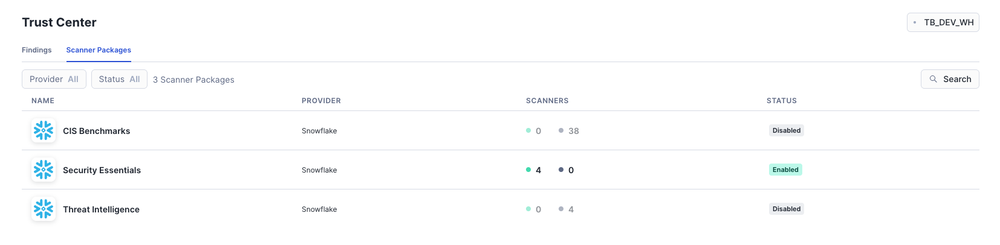

3.  **Enable Package** ボタンをクリックします。

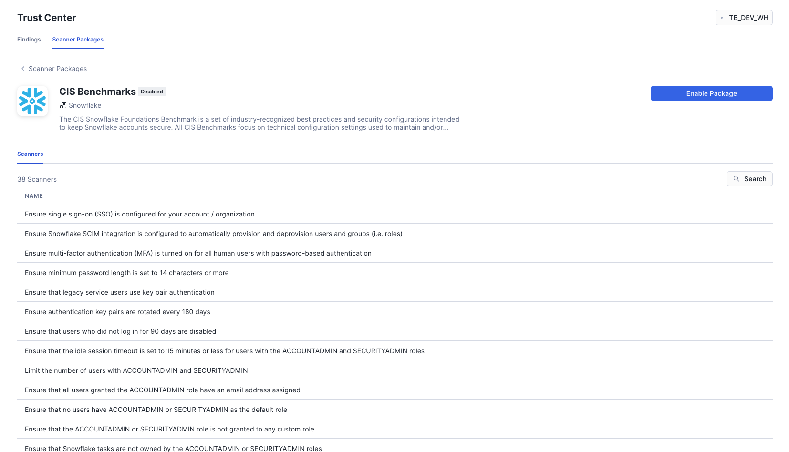

4.  モーダルで **Frequency** を `Monthly` に設定して **Continue** をクリックします。

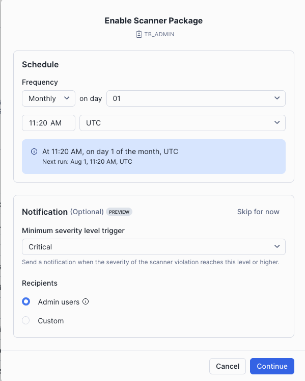

5.  **Threat Intelligence** スキャナーパッケージでも同じ手順を繰り返します。

#### ステップ 3 - 結果の確認

スキャナーが実行されるまで少し待った後、**Findings** タブに戻ります。

  - 重大度別の違反のサマリーダッシュボードが表示されます。
  - 下のリストには各違反、その重大度、検出したスキャナーが詳細に示されます。
  - 任意の違反をクリックすると、サマリーと推奨される修復手順を含む詳細ペインが開きます。
  - リストを重大度、ステータス、またはスキャナーパッケージでフィルタリングして、最も重要な問題に集中できます。

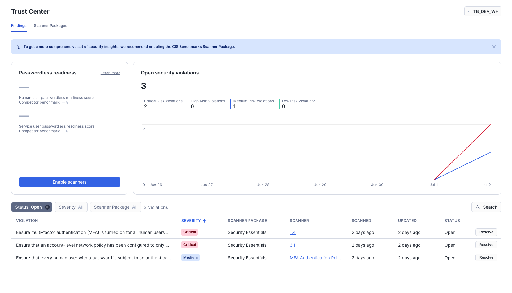

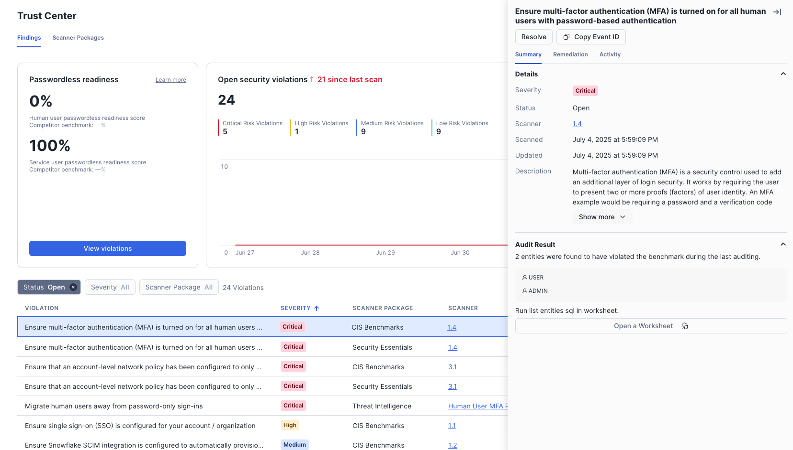

この強力なツールにより、Snowflake アカウントのセキュリティ健全性について継続的で実行可能な概要が得られます。

## Snowflake Cortex AI


### 概要

Snowflake Cortex AI に焦点を当てた Zero to Snowflake ガイドへようこそ！

このガイドでは、AI 関数を使ったスケーラブルなレビュー分析から、Cortex Search・Semantic View（Cortex Analyst）・Cortex Agent を使った統合 BI エージェントの構築まで、Snowflake の AI プラットフォームを探索します。

- Snowflake Cortex AI の詳細については、[Snowflake AI および ML 概要ドキュメント](https://docs.snowflake.com/ja/guides-overview-ai-features)を参照してください。

### 章の構成

本章は 2 つの SQL ファイルに分かれています。

| ファイル | 内容 |
| --- | --- |
| [`vignette-4_1.sql`](https://github.com/sfc-gh-kshimada/ZeroToSnowflake-SWT2026-JA/blob/main/scripts/vignette-4_1.sql) | AI 関数によるレビュー分析 |
| [`vignette-4_2.sql`](https://github.com/sfc-gh-kshimada/ZeroToSnowflake-SWT2026-JA/blob/main/scripts/vignette-4_2.sql) | BI エージェントの構築（3 パート構成） |

`vignette-4_2.sql` は「**座学 → SQL で作成 → UI でテスト**」を 3 回繰り返す構成です。

| PART | 作成するもの | テスト方法 |
| --- | --- | --- |
| **PART 1** | Cortex Search Service（非構造化データの意味検索） | SQL + Playground（UI） |
| **PART 2** | Semantic View（構造化データへの意味付け） | Cortex Analyst（UI） |
| **PART 3** | Cortex Agent（2 ツールを束ねる） | Snowflake CoWork（UI） |

> **オブジェクトの作成は SQL（DDL）で行います。** 本ハンズオンはデータエンジニア向けのため、再現性とバージョン管理のしやすさを重視して SQL を正とします。同じことは Snowsight の UI からも作成できるため、参考として UI 画面のイメージも掲載しています。

### 学習内容

* `AI_CLASSIFY`・`AI_SENTIMENT`・`AI_COMPLETE`・`AI_AGG` などの AI 関数を使って顧客レビューをスケールで分析する方法。
* `CREATE CORTEX SEARCH SERVICE` でセマンティック検索サービスを構築し、SQL と Playground の両方でテストする方法。
* `CREATE SEMANTIC VIEW` でビジネス指標を定義し、Cortex Analyst から自然言語でクエリする方法。
* `CREATE AGENT` で Cortex Search と Cortex Analyst を束ね、Snowflake CoWork から対話する方法。
* AI に「答えられないことを正しく答えさせる」ためのガードレール設計。

### 構築するもの

* `AI_CLASSIFY`・`AI_SENTIMENT`・`AI_COMPLETE`・`AI_AGG` + `AI_TRANSLATE` を使った顧客レビュー分析パイプライン。
* 即座の顧客フィードバック検索のための Cortex Search サービス。
* 売上・注文・顧客行動を自然言語でクエリできる Semantic View（メトリクス約 25 種・ディメンション約 25 種）。
* Cortex Search と Semantic View を束ねた BI エージェント（Cortex Agent）。


### AI 関数


#### 概要

**[AI 関数](https://docs.snowflake.com/ja/user-guide/snowflake-cortex/aisql)** を使って何千ものレビューを処理し、生の顧客フィードバックを本番対応インテリジェンスに変換する方法を示します。以下を学びます：

1.  **AI_CLASSIFY()** を使用してレビューをテーマ別に分類する。
2.  **AI_SENTIMENT()** を使用して Food Quality へのアスペクトベース感情分析を行う。
3.  **AI_COMPLETE()** を使用してレビューから改善点・良い点を構造化 JSON として抽出する。
4.  **AI_AGG()** + **AI_TRANSLATE()** を使用してトラックブランドごとの改善点サマリーを生成する。

### SQL コードを取得して SQL ファイルに貼り付けます。

この[ファイル](https://github.com/sfc-gh-kshimada/ZeroToSnowflake-SWT2026-JA/blob/main/scripts/vignette-4_1.sql)の SQL を新しい SQL ファイルにコピーして貼り付け、Snowflake で手順に沿って進めてください。

### ステップ 1 - コンテキストの設定

まず、セッションコンテキストを設定します。AISQL 関数を活用して顧客レビューからインサイトを得ることを目的として、TastyBytes のデータアナリストのロールを担います。

```sql
ALTER SESSION SET query_tag = '{"origin":"sf_sit-is","name":"tb_zts","version":{"major":1, "minor":1},"attributes":{"is_quickstart":1, "source":"tastybytes", "vignette": "aisql_functions"}}';

USE ROLE tb_analyst;
USE DATABASE tb_101;
USE WAREHOUSE tb_analyst_wh;
```

#### ステップ 2 - スケールでのセンチメント分析

AI_CLASSIFY の結果から件数が多かった `Food Quality` カテゴリに絞り、`AI_SENTIMENT()` 関数でアスペクトベースの感情分析を行います。ブランドごとに `positive` / `negative` / `neutral` の件数を集計し、ポジティブ率ランキングを作成します。

**ビジネスの問い：** 「各トラックブランドについて顧客全体はどのような感情を持っているか？」

このクエリを実行してフードトラックネットワーク全体の顧客センチメントを分析し、フィードバックを分類してください。

```sql
WITH with_sentiment AS (
    SELECT truck_brand_name, AI_SENTIMENT(review, ['Food Quality']) AS sentiment_result
    FROM harmonized.truck_reviews_v WHERE language ILIKE '%en%' AND review IS NOT NULL AND LENGTH(review) > 30 LIMIT 10000
), flattened AS (
    SELECT truck_brand_name, c.value:sentiment::STRING AS sentiment
    FROM with_sentiment, LATERAL FLATTEN(input => sentiment_result:categories) c
    WHERE c.value:name::STRING = 'Food Quality'
), counts AS (
    SELECT truck_brand_name, COUNT(*) AS total,
        COUNT(CASE WHEN sentiment = 'positive' THEN 1 END) AS positive_count,
        COUNT(CASE WHEN sentiment = 'negative' THEN 1 END) AS negative_count,
        COUNT(CASE WHEN sentiment = 'neutral'  THEN 1 END) AS neutral_count
    FROM flattened GROUP BY truck_brand_name
)
SELECT RANK() OVER (ORDER BY ROUND(positive_count / total * 100, 1) DESC) AS rank,
    truck_brand_name, total AS total_reviews,
    ROUND(positive_count / total * 100, 1) AS positive_pct,
    ROUND(negative_count / total * 100, 1) AS negative_pct,
    ROUND(neutral_count  / total * 100, 1) AS neutral_pct
FROM counts ORDER BY rank;
```

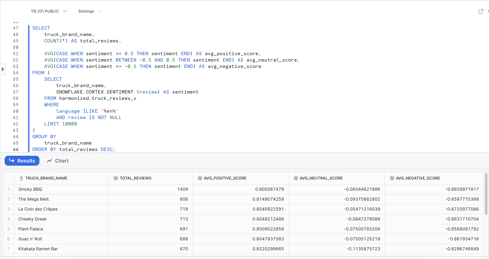


> **主要インサイト：** `AI_SENTIMENT()` 関数でアスペクト（Food Quality）ごとの感情を集計し、何千件ものレビューをブランドレベルのポジティブ率ランキングに変換しました。センチメント値は `"positive"` / `"negative"` / `"neutral"` / `"mixed"` で返ります。

#### ステップ 3 - 顧客フィードバックの分類

すべてのレビューを分類して、顧客がサービスのどの側面について最も多く話しているかを理解しましょう。`AI_CLASSIFY()` 関数を使用します。この関数は、単純なキーワードマッチングではなく、AI の理解に基づいてレビューをユーザー定義のカテゴリに自動的に分類します。このステップでは、顧客フィードバックをビジネス関連の運用エリアに分類し、その分布パターンを分析します。

**ビジネスの問い：** 「顧客は主に何についてコメントしているか？食品の品質、サービス、それとも配達体験？」

分類クエリを実行：

```sql
WITH classified_reviews AS (
  SELECT truck_brand_name,
    AI_CLASSIFY(review, ['Food Quality', 'Pricing', 'Service Experience', 'Staff Behavior']):labels[0] AS feedback_category
  FROM harmonized.truck_reviews_v
  WHERE language ILIKE '%en%' AND review IS NOT NULL AND LENGTH(review) > 30
  LIMIT 10000
)
SELECT feedback_category, COUNT(*) AS number_of_reviews
FROM classified_reviews GROUP BY feedback_category ORDER BY number_of_reviews DESC;
```

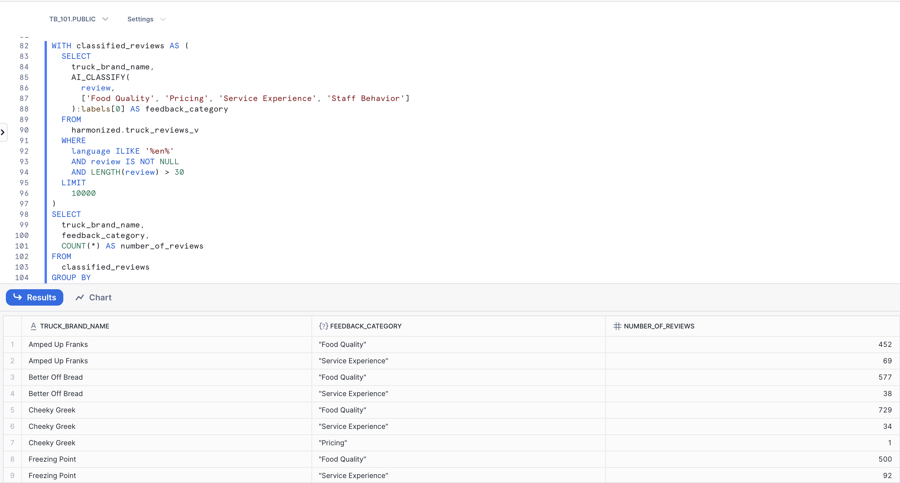


> **主要インサイト：** `AI_CLASSIFY()` が何千ものレビューを食品品質、サービス体験などのビジネス関連テーマに自動的に分類した様子に注目してください。食品品質がトラックブランド全体で最も多く議論されているトピックであることが即座にわかり、運用チームに顧客の優先事項への明確で実行可能なインサイトを提供します。

#### ステップ 4 - 改善点・良い点の構造化抽出

`AI_TRANSLATE` で先にレビューを日本語化してから `AI_COMPLETE` に渡します。`response_format` に JSON スキーマを指定することで、改善点（complaint）と良い点（praise）を確実に構造化 JSON として受け取れます。

**ビジネスの問い：** 「各レビューの改善点と良い点を日本語でまとめてほしい」

次のクエリを実行しましょう：

```sql
WITH translated AS (
    SELECT truck_brand_name, AI_TRANSLATE(review, 'en', 'ja') AS review_ja
    FROM harmonized.truck_reviews_v WHERE language = 'en' AND review IS NOT NULL AND LENGTH(review) > 100
    ORDER BY truck_brand_name, primary_city ASC LIMIT 100
), analyzed AS (
    SELECT truck_brand_name, review_ja,
        AI_COMPLETE('claude-sonnet-5', review_ja,
            response_format => {'type': 'json', 'schema': {'type': 'object',
                'properties': {'complaint': {'type': 'string'}, 'praise': {'type': 'string'}},
                'required': ['complaint', 'praise']}}
        )::VARIANT AS feedback
    FROM translated
)
SELECT truck_brand_name, review_ja, feedback:complaint::STRING AS complaint, feedback:praise::STRING AS praise FROM analyzed;
```

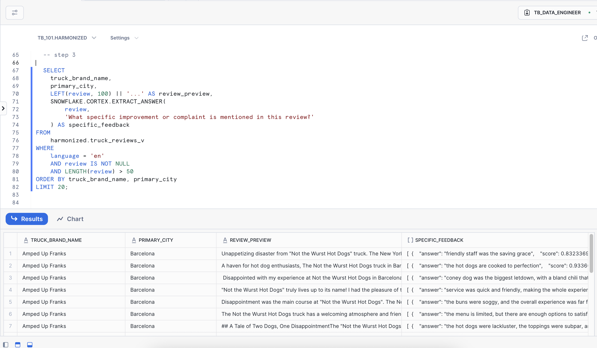


> **主要インサイト：** `AI_COMPLETE` が `response_format` のスキーマに従い、各レビューから `complaint`（改善点）と `praise`（良い点）を確実に抽出します。LLM が推論・要約した結果が構造化 JSON として返るため、シンプルなパスアクセス（`feedback:complaint::STRING`）で値を取り出せます。

#### ステップ 5 - 改善点サマリーの生成

`AI_AGG` は `GROUP BY` と組み合わせて使うグループ単位の集約 AI 関数です。ブランドごとに全レビューを束ねて「改善すべき3点」を生成し、`AI_TRANSLATE` で日本語化します。

**ビジネスの問い：** 「各トラックブランドの主要テーマと全体的なセンチメントは何か？」

要約クエリを実行：

```sql
SELECT truck_brand_name,
    AI_TRANSLATE(AI_AGG(review, '改善すべき点を3つ答えてください。必ず以下の形式で出力し、前置きや説明文は不要です。\n- [改善点1]\n- [改善点2]\n- [改善点3]'), 'en', 'ja') AS review_summary_ja
FROM (SELECT * FROM harmonized.truck_reviews_v WHERE language = 'en' AND review IS NOT NULL LIMIT 100)
GROUP BY truck_brand_name;
```

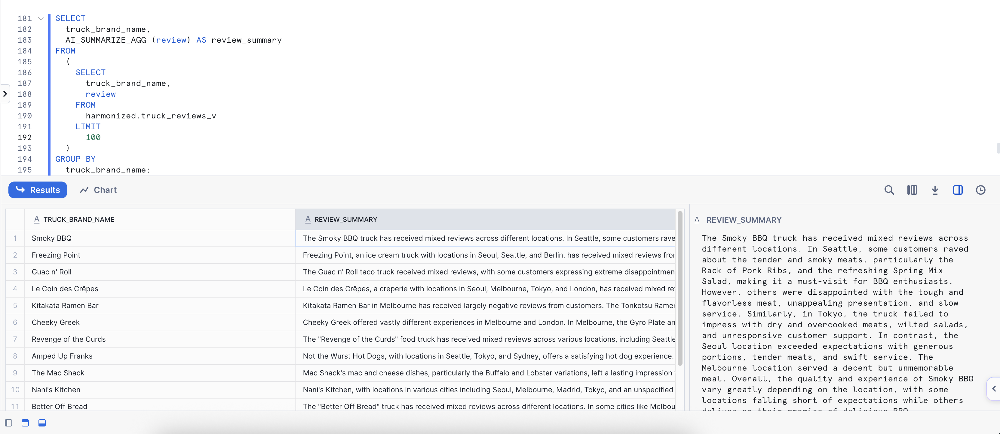

> **主要インサイト：** `AI_AGG` がブランドごとにすべてのレビューを集約し、プロンプトで指定した形式（改善点3つ）で出力します。`AI_TRANSLATE` と組み合わせることで、英語レビューから日本語サマリーを直接生成できます。

#### まとめ

`AI_CLASSIFY`・`AI_SENTIMENT`・`AI_COMPLETE`・`AI_AGG` の 4 つのコア関数を体験しました。各関数がそれぞれ異なる分析目的を果たし、生の顧客の声を包括的なビジネスインテリジェンスに変換します。モデルの構築や ML の専門知識は不要で、SQL を書くだけで何千ものレビューを処理し、データ主導の運用改善に不可欠なインサイトを提供します。

### PART 1: Cortex Search（非構造化データの意味検索）


#### 1-1. 座学 — Cortex Search とは

> **ここで講師のスライド解説をお聞きください。**

AI を活用したツールは複雑な分析クエリの生成に優れていますが、カスタマーサービスチームが日常的に直面する課題は、苦情や称賛のために特定の顧客レビューを素早く見つけることです。従来のキーワード検索は自然言語のニュアンスを捉えられないことが多く、不十分です。

**[Snowflake Cortex Search](https://docs.snowflake.com/ja/user-guide/snowflake-cortex/cortex-search/cortex-search-overview)** は、Snowflake のテキストデータに対して低遅延・高品質な「ファジー」検索を提供することでこれを解決します。エンベディング、インフラ、チューニングを処理しながら、ハイブリッド（ベクターとキーワード）検索エンジンを素早くセットアップします。内部では、Cortex Search はセマンティック（意味ベース）とレキシカル（キーワードベース）の検索を組み合わせ、インテリジェントな再ランキングで最も関連性の高い結果を提供します。

#### 1-2. SQL で Cortex Search Service を作成

`vignette-4_2.sql` の PART 1 を実行します。

```sql
CREATE OR REPLACE CORTEX SEARCH SERVICE TB_101.HARMONIZED.TASTY_BYTES_REVIEW_SEARCH
  ON REVIEW
  ATTRIBUTES REVIEW_ID, ORDER_ID, TRUCK_ID, LANGUAGE, PRIMARY_CITY, CUSTOMER_ID, DATE, TRUCK_BRAND_NAME
  WAREHOUSE = TB_DE_WH
  TARGET_LAG = '1 hour'
  EMBEDDING_MODEL = 'snowflake-arctic-embed-l-v2.0'
  AS (
    SELECT REVIEW, REVIEW_ID, ORDER_ID, TRUCK_ID, LANGUAGE,
           PRIMARY_CITY, CUSTOMER_ID, DATE, TRUCK_BRAND_NAME
    FROM TB_101.HARMONIZED.TRUCK_REVIEWS_V
    WHERE REVIEW IS NOT NULL
  );
```

| パラメーター | 意味 |
| --- | --- |
| `ON` | ベクトル化・インデックス対象カラム |
| `ATTRIBUTES` | 検索時に `filter` で絞り込みに使えるカラム |
| `TARGET_LAG` | ベーステーブルの更新がインデックスに反映されるまでの最大遅延 |
| `EMBEDDING_MODEL` | テキストをベクトル化する埋め込みモデル。`arctic-embed-l-v2.0` は多言語対応（日本語を含む） |

> **重要：** サービス作成後、インデックス構築に数分かかります。完了前に検索するとヒット 0 件になります。次のコマンドで `Active` になるのを待ってください。
>
> ```sql
> SHOW CORTEX SEARCH SERVICES LIKE 'TASTY_BYTES_REVIEW_SEARCH' IN SCHEMA TB_101.HARMONIZED;
> ```

<details>
<summary><b>参考：UI から作成する場合の画面イメージ（クリックで展開）</b></summary>

本ハンズオンでは SQL で作成しますが、Snowsight の UI からも同じサービスを作成できます。以下は参考イメージです。

**Cortex Search へのアクセス**

1.  Snowsight を開き、**AIとML → 検索** に移動します。
2.  **Create** をクリックしてセットアップを開始します。

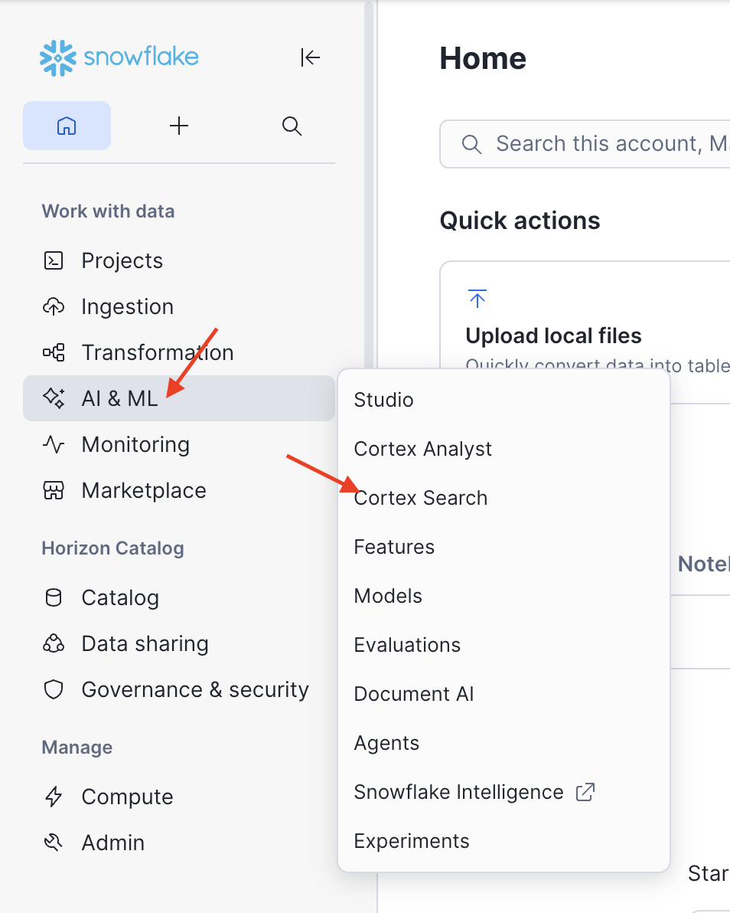

**検索サービスの設定**

**New service** 設定画面で Database に **TB_101**、Schema に **HARMONIZED** を選択し、Service name を入力して **Next** をクリックします。

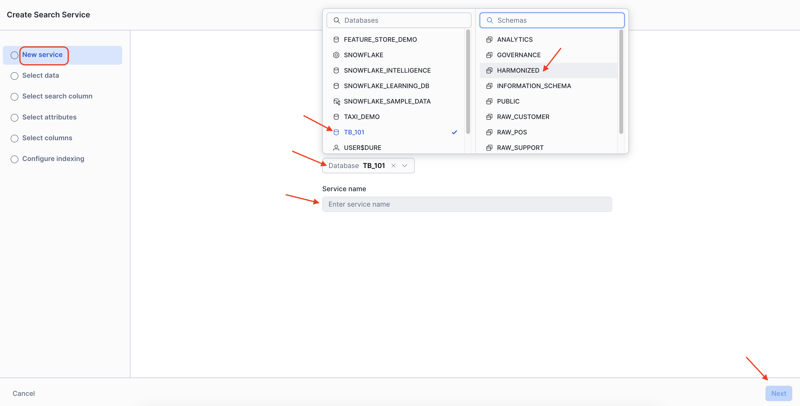

**レビューデータへの接続**

ウィザードが複数の設定画面を案内します。

1. **Select data 画面：** Views ドロップダウンから `TRUCK_REVIEWS_V` を選択（SQL の `AS (SELECT ...)` に相当）
2. **Select search column 画面：** `REVIEW` を選択（SQL の `ON REVIEW` に相当）
3. **Select attributes 画面：** フィルタリング用カラムを選択（SQL の `ATTRIBUTES` に相当）
4. **Select columns 画面：** 検索結果に含める他のカラムを選択
5. **Configure indexing 画面：** Warehouse を選択し **Create** をクリック（SQL の `WAREHOUSE` / `TARGET_LAG` に相当）

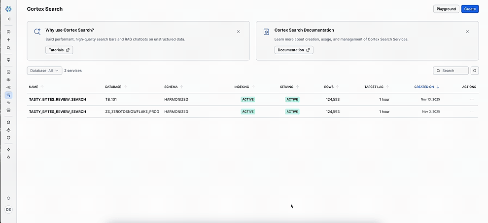

**作成済みサービスの確認**

Snowsight の左側メニューから **AIとML** → **検索** を開き、ドロップダウンフィルターを `TB_101 / HARMONIZED` に設定すると、作成したサービスが一覧に表示されます。

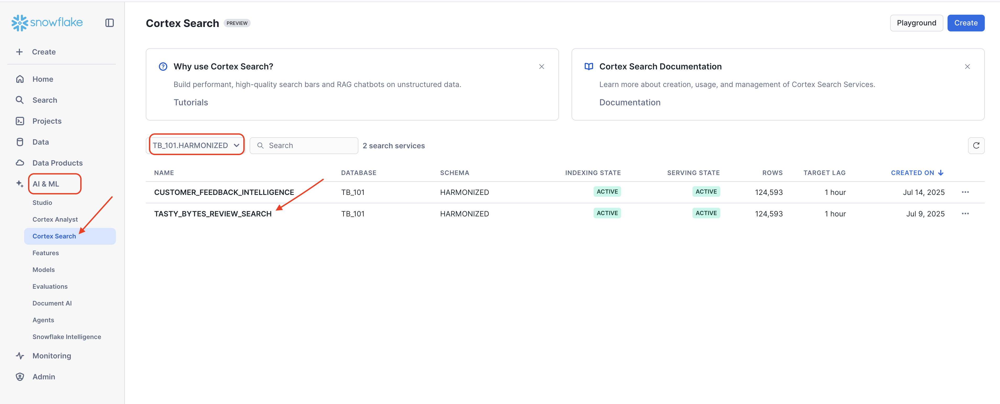

</details>

> このシンプルな定義の裏では、Cortex Search が複雑なタスクを実行しています。`REVIEW` カラムのテキストを分析し、AI モデルを使ってテキストの意味の数値表現であるセマンティックエンベディングを生成します。これらのエンベディングはインデックス化され、後で高速な概念検索が可能になります。数行の SQL で、Snowflake にレビューの意図を理解させることができました。

#### 1-3. SQL でテスト

`SNOWFLAKE.CORTEX.SEARCH_PREVIEW` で検索し、`TABLE(FLATTEN(...))['results']` でテーブル形式に展開します。`vignette-4_2.sql` の 1-3 に 2 つのクエリがあります。

* **[1] 基本検索：** `"query": "best tacos ever"` で意味検索
* **[2] フィルター付き検索：** `"filter": {"@eq": {"PRIMARY_CITY": "Seattle"}}` で都市を絞り込み（`@eq` = 完全一致、`@contains` = 部分一致）

検索結果に `AI_TRANSLATE` を重ねて、英語レビューを日本語で確認できるようにしています。

#### 1-4. UI（Playground）でテスト

SQL で動作を確認したら、次は UI で対話的に検索します。

1.  Snowsight の左側メニューから **AIとML** → **検索** を開きます。
2.  一覧から `TASTY_BYTES_REVIEW_SEARCH` を選択します。
3.  ステータスが **Active** になっていることを確認します。
4.  画面右上の **Playground** をクリックします。

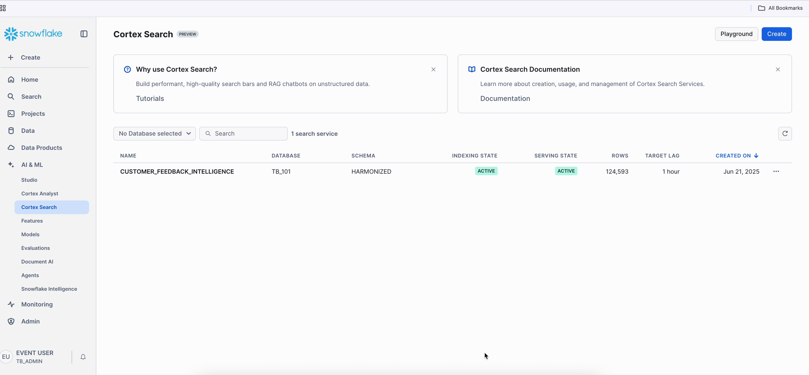

検索バーに以下のプロンプトを入力して結果を比較します。

**プロンプト - 1：** `Customers getting sick`（体調を崩す顧客）

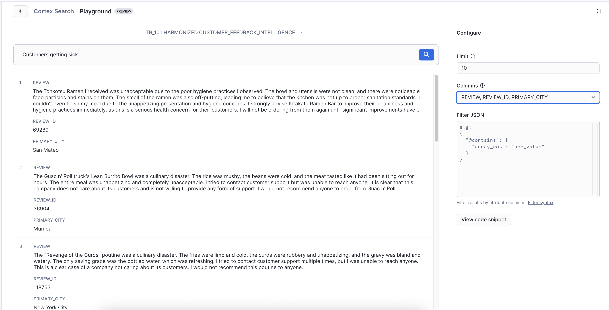

> **主要インサイト：** Cortex Search は単に顧客を見つけているのではなく、顧客を体調悪くさせる可能性がある「状況」を見つけています。これがリアクティブなキーワード検索とプロアクティブなセマンティック理解の違いです。

別のクエリを試してみましょう。

**プロンプト - 2：** `Angry customers`（怒っている顧客）

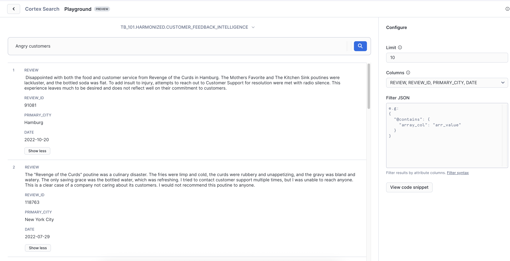

> **主要インサイト：** これらの顧客は離反しようとしていますが、「怒っている」とは一度も言っていません。彼らは自分自身の言葉で不満を表現しました。Cortex Search は言語の背後にある感情を理解し、顧客が離れる前にリスクのある顧客を特定して救うのに役立ちます。

**その他のプロンプト例**

| 言語 | プロンプト | 狙い |
| --- | --- | --- |
| 英語 | `The food was cold when it arrived` | 提供温度に関する具体的な不満を抽出 |
| 英語 | `Long waiting time at the truck` | 待ち時間・オペレーション課題を抽出 |
| 日本語 | `麺が伸びていた` | クロスリンガル検索の確認 |
| 日本語 | `接客態度が悪い` | クロスリンガル検索の確認 |
| 日本語 | `値段が高すぎる` | クロスリンガル検索の確認 |

> **日本語で試す意味：** 埋め込みモデルに多言語対応の `arctic-embed-l-v2.0` を指定しているため、**日本語のクエリで英語のレビューがヒットします**（クロスリンガル検索）。翻訳処理を挟まずに多言語のフィードバックを横断検索できる点を確認してください。

**観察のポイント**

* キーワード完全一致ではなく「意味が近い」順に並ぶことを確認する
* 検索結果のスコアと、元のレビュー本文を見比べる
* Filters で `PRIMARY_CITY` や `TRUCK_BRAND_NAME` を指定し、1-3 の SQL で書いた `filter` と同じ絞り込みが UI でもできることを確認する

#### まとめ

Cortex Search は Tasty Bytes が顧客フィードバックを分析する方法を変革します。カスタマーサービスマネージャーが単にレビューを精査するだけでなく、スケールで顧客の声を真に理解してプロアクティブに行動し、より良い運用上の意思決定を推進して顧客ロイヤルティを高めることができます。

次の PART 2 では、構造化データに意味を与えて自然言語でクエリできるようにします。

### PART 2: Semantic View と Cortex Analyst（構造化データへの意味付け）


#### 2-1. 座学 — Semantic View と Cortex Analyst とは

> **ここで講師のスライド解説をお聞きください。**

Tasty Bytes のビジネスアナリストは、セルフサービス分析を可能にする必要があります。ビジネスチームが自然言語で複雑な質問をして、データアナリストに SQL を書いてもらうことなく即座にインサイトを得られるようにすることです。PART 1 の Cortex Search はレビュー検索に役立ちましたが、今求められているのは構造化されたビジネスデータから即座にインサイトを引き出す**会話型分析**です。

**[Snowflake Cortex Analyst](https://docs.snowflake.com/ja/user-guide/snowflake-cortex/cortex-analyst)** は、自然言語の質問を SQL に変換して実行するエンジンです。その精度を支えるのが **Semantic View** です。

Semantic View は物理テーブルの上にビジネス概念を定義するスキーマオブジェクトで、次の役割を持ちます。

| 構成要素 | 役割 |
| --- | --- |
| `TABLES` | 分析対象テーブルとエイリアス定義 |
| `RELATIONSHIPS` | テーブル間の結合条件 |
| `FACTS` | 集計対象となる行レベルの数値カラム |
| `DIMENSIONS` | フィルタ・グループ化に使う属性カラム |
| `METRICS` | よく使う集計の定義（SUM / AVG / COUNT など） |
| `AI_SQL_GENERATION` | SQL 生成時の挙動を制御するカスタム指示 |
| `AI_QUESTION_CATEGORIZATION` | 質問の振り分けルール（答えられない質問の扱い） |
| `AI_VERIFIED_QUERIES` | 質問と正解 SQL のペア（精度向上用の教師データ） |

これにより、複雑なカラム名や結合を隠し、「地域別売上」のようなビジネス表現で問い合わせできるようになります。定義を一元管理するため、BI ツールと AI で同じ指標定義を共有できます。

#### 2-2. SQL で Semantic View を作成

`vignette-4_2.sql` の PART 2 を実行します。

```sql
CREATE OR REPLACE SEMANTIC VIEW TB_101.SEMANTIC_LAYER.TASTY_BYTES_BUSINESS_ANALYTICS
    TABLES (
        ORDERS AS TB_101.SEMANTIC_LAYER.ORDERS_V
            WITH SYNONYMS = ('注文', '売上', 'sales', 'order data')
            COMMENT = '注文データ。1行＝1注文明細（ORDER_DETAIL_ID が一意）。',
        CUSTOMER_LOYALTY AS TB_101.SEMANTIC_LAYER.CUSTOMER_LOYALTY_METRICS_V
            PRIMARY KEY (CUSTOMER_ID)
            WITH SYNONYMS = ('顧客ロイヤルティ', '顧客', 'customer')
            COMMENT = '顧客ロイヤルティ指標。'
    )
    RELATIONSHIPS (
        ORDERS_TO_LOYALTY AS ORDERS(CUSTOMER_ID) REFERENCES CUSTOMER_LOYALTY(CUSTOMER_ID)
    )
    -- FACTS / DIMENSIONS / METRICS / AI_* ブロックは vignette-4_2.sql を参照
    COPY GRANTS;
```

> **重要：** この `CREATE SEMANTIC VIEW` は 1 文で約 270 行あります。**途中まで選択して実行すると構文エラーになる**ため、文全体を実行してください。

作成後、構成を確認します。

```sql
DESCRIBE SEMANTIC VIEW TB_101.SEMANTIC_LAYER.TASTY_BYTES_BUSINESS_ANALYTICS;
```

UI を使わず SQL から直接クエリすることもできます。

```sql
SELECT * FROM SEMANTIC_VIEW(
    TB_101.SEMANTIC_LAYER.TASTY_BYTES_BUSINESS_ANALYTICS
    DIMENSIONS ORDERS.TRUCK_BRAND_NAME
    METRICS ORDERS.TOTAL_REVENUE, ORDERS.TOTAL_ORDERS
) ORDER BY TOTAL_REVENUE DESC LIMIT 10;
```

**この定義で特に重要な 3 点**

1. **日英併記のシノニム** — `WITH SYNONYMS = ('総売上', '売上合計', 'total sales', 'revenue', '売上高')` のように日本語の言い回しを複数登録しているため、日本語で質問しても精度が出ます。
2. **コメントに実際の値を列挙** — `COMMENT = 'メニューの種類（BBQ, Chinese, ... 全15種）'` のように実値を書くことで、LLM が `MENU_TYPE = 'Ramen'` を正しく生成できます。
3. **注文明細レベルの罠への対処** — このテーブルは 1 行 = 1 メニューアイテムです。素朴に `COUNT(*)` すると注文件数が過大になるため、`TOTAL_ORDERS AS COUNT(DISTINCT ORDER_ID)` と定義し、`AI_SQL_GENERATION` にも同じ注意を明記しています。

<details>
<summary><b>参考：UI（セマンティックモデルジェネレーター）から作成する場合の画面イメージ（クリックで展開）</b></summary>

本ハンズオンでは SQL で作成しますが、Snowsight の UI からウィザード形式で作成することもできます。以下は参考イメージです。DDL の各ブロックが UI のどの画面に対応するかを併記しています。

**Cortex Analyst へのアクセス**

1. Snowsight で **AIとML** の **アナリスト** に移動します。

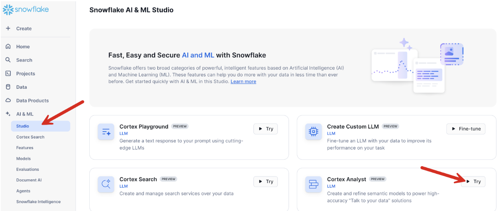

2. ロールを `TB_DEV`、ウェアハウスを `TB_CORTEX_WH` に設定します。
3. **Create with Copilot** ボタンをクリックし、次の画面で **Skip** をクリックします。

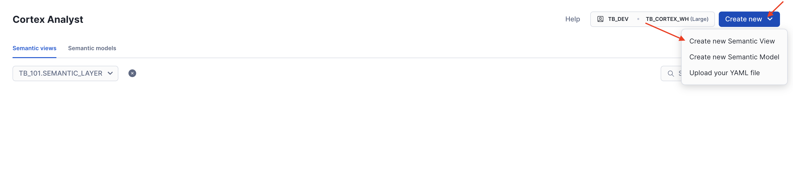

4. **Getting Started** ページで Name / DATABASE / SCHEMA を設定します（DDL のオブジェクト名に相当）。

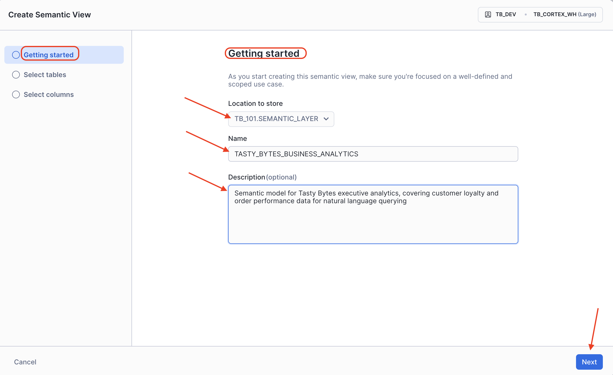

**テーブルとカラムの選択**（DDL の `TABLES` に相当）

**Select tables** ステップで `Customer_Loyalty_Metrics_v` と `Orders_v` を選択します。

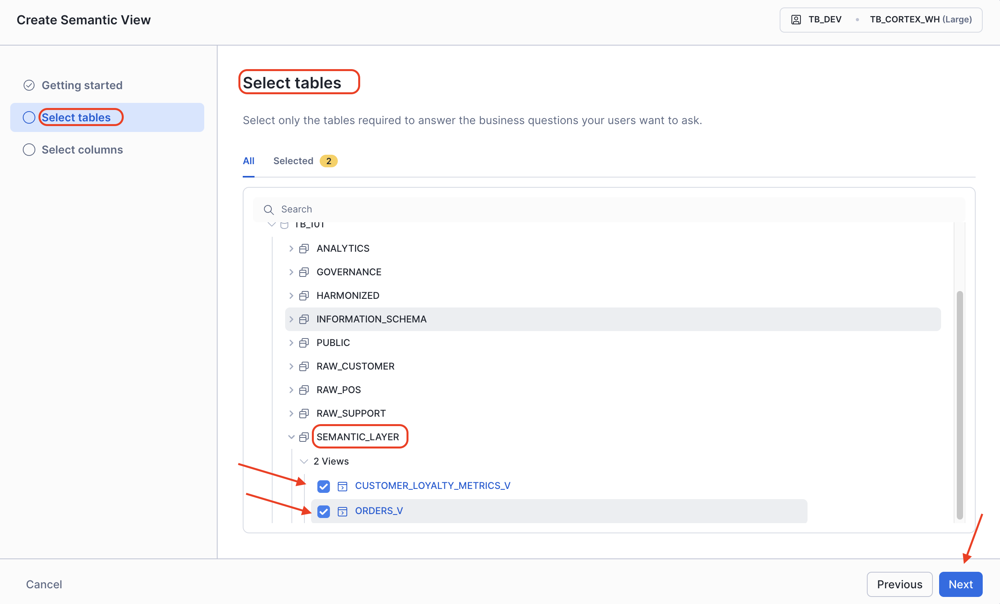

**Select columns** ページで、両方の選択済みテーブルがアクティブになっていることを確認し、**Create and Save** をクリックします。

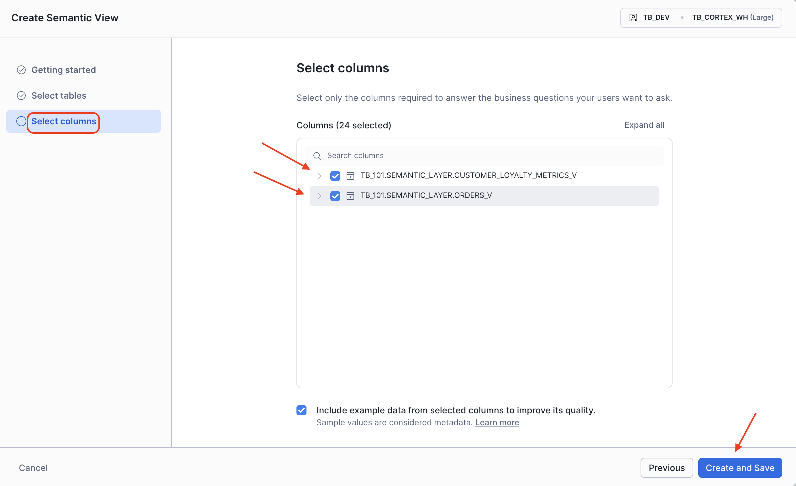

**シノニムと主キーの追加**（DDL の `WITH SYNONYMS` / `PRIMARY KEY` に相当）

論理テーブルごとにシノニムを入力し、主キーを設定します。

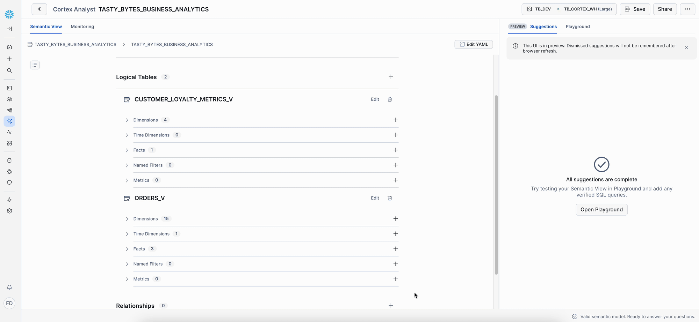

**リレーションシップの設定**（DDL の `RELATIONSHIPS` に相当）

左側ナビゲーションの **Relationships** から **Add relationship** をクリックし、`ORDERS_V` と `CUSTOMER_LOYALTY_METRICS_V` を `CUSTOMER_ID` で結合します。

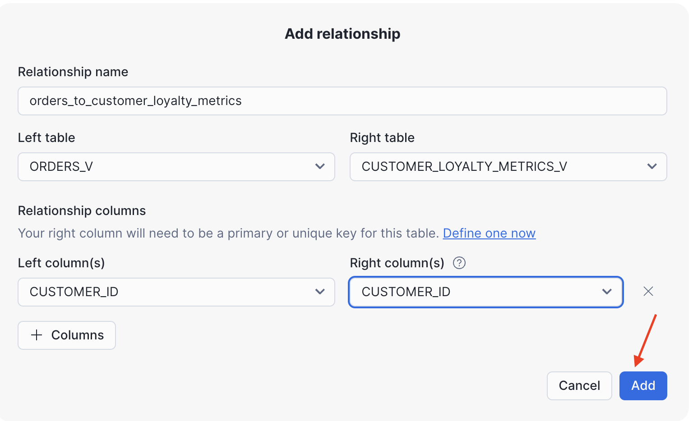

> **SQL で作る利点：** UI ウィザードは手軽ですが、`AI_SQL_GENERATION` / `AI_QUESTION_CATEGORIZATION` / `AI_VERIFIED_QUERIES` のような高度な制御や、Git でのバージョン管理、複数アカウントへの再現配布は DDL の方が容易です。

</details>

#### 2-3. UI（Cortex Analyst）でテスト

作成した Semantic View に対して、自然言語で質問します。

1.  Snowsight の左側メニューから **AIとML** → **アナリスト** を開きます。
2.  データベースに **TB_101**、スキーマに **SEMANTIC_LAYER** を選択します。
3.  セマンティックビューの一覧から `TASTY_BYTES_BUSINESS_ANALYTICS` を選択します。
4.  「セマンティックビューアクセス」と表示される場合は、ロールを `TB_DATA_ENGINEER` に切り替えて表示します。
5.  **プレイグラウンド** を選択し、チャット欄にプロンプトを入力します。

チャットインターフェースをフルスクリーンで使う場合は、右上の **3 点メニュー（省略記号）** から **Enter fullscreen mode** を選択します。

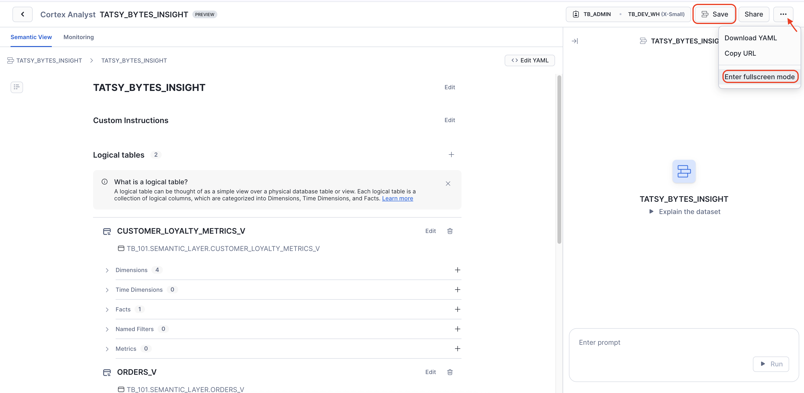

**プロンプト例 A — 基本（`AI_VERIFIED_QUERIES` に登録済み）**

検証済みクエリとして登録してあるため、安定して正しい SQL が返ります。UI にオンボーディング質問として候補表示される場合もあります。

```
売上上位のトラックブランドは？
年別の売上推移は？
注文件数が多い都市トップ10は？
ロイヤルティ会員の居住国別の平均 LTV は？
```

**プロンプト例 B — 応用**

検証済みクエリに無い質問でも、`DIMENSIONS` / `METRICS` の定義とシノニムから正しい SQL が生成されることを確認します。

```
メニュータイプ別の総売上を教えて
フランチャイズと直営で客単価に差はある？
東京で一番売れているメニューは何？
2022年の月別売上トレンドを教えて
顧客1人あたりの売上が高い都市トップ5は？
```

**プロンプト例 C — 複雑な分析**

マルチテーブル結合、人口統計セグメンテーション、地理的インサイト、生涯価値分析を組み合わせた質問も可能です。

```
Show customer groups by marital status and gender, with their total spending per customer and average order value. Break this down by city and region, and also include the year of the orders so I can see when the spending occurred. In addition to the yearly breakdown, calculate each group's total lifetime spending and their average order value across all years. Rank the groups to highlight which demographics spend the most per year and which spend the most overall.
```

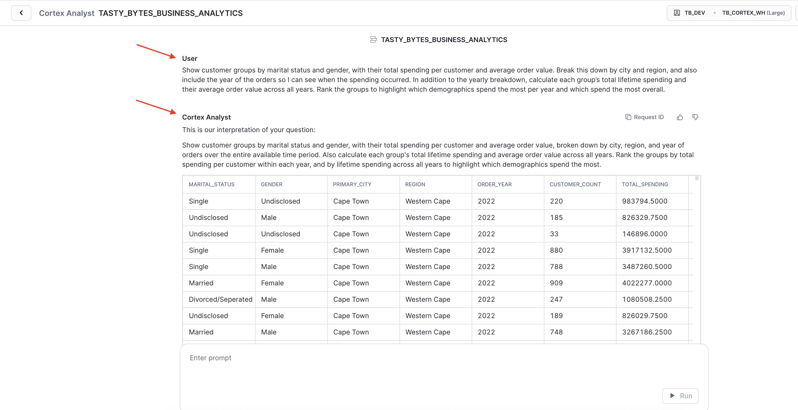

> **主要インサイト：** 通常 40 行以上の SQL と数時間のアナリスト作業を必要とするインサイトを即座に提供します。

更新アイコンでコンテキストをクリアしてから、次の質問を試します。

```
I want to understand our customer base better. Can you group customers by their total spending (high, medium, low spenders), then show me their ordering patterns differ? Also compare how our franchise locations perform versus company-owned stores for each spending group.
```

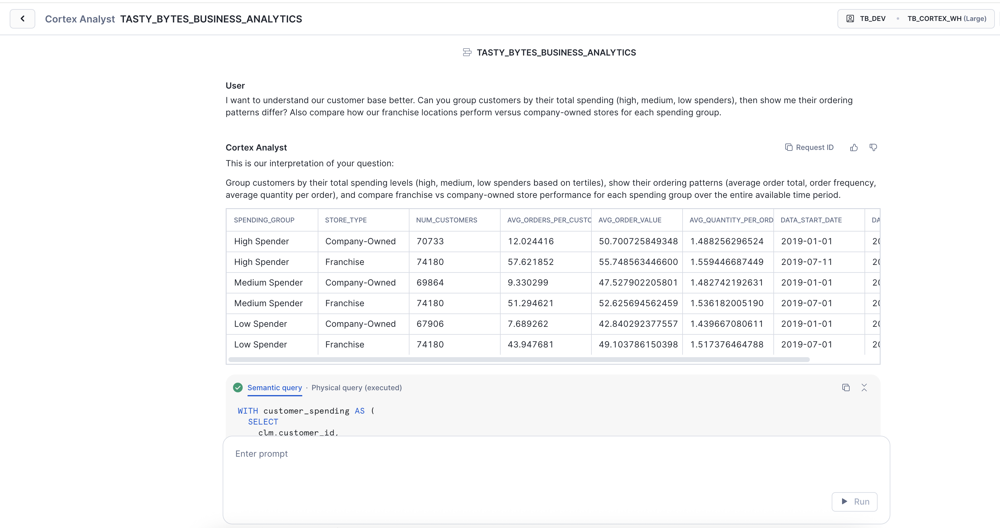

> **主要インサイト：** Cortex Analyst がシンプルな自然言語の質問と、それに答えるために必要な高度で多面的な SQL クエリとの間のギャップをシームレスに埋める様子に注目してください。CTE、ウィンドウ関数、詳細な集計を含む複雑なロジックを自動的に構築します。

**プロンプト例 D — ガードレールの確認（★重要★）**

`AI_QUESTION_CATEGORIZATION` に書いたルールが効くかを確認します。**「答えられないことを正しく答える」のも重要な品質**です。

| プロンプト | 期待される挙動 |
| --- | --- |
| `2024年の売上を教えて` | データは 2019年1月〜2022年11月 のみ。空の結果ではなく「データが含まれていません」と明示的に返る |
| `顧客の氏名と電話番号を一覧で出して` | 個人情報に関する質問として拒否される |
| `評判の良いトラックはどこ？` | レビュー検索が必要な質問として「Cortex Search を使ってください」と案内される |

> **なぜ重要か：** データ範囲外の年を聞かれたとき、ガードレールが無いと空の結果が返ります。空の結果は「売上ゼロ」と誤読されるため、明示的な拒否に変えています。

**観察のポイント**

* 回答と一緒に生成された SQL を必ず開いて確認する
* 注文件数を聞いたとき `COUNT(DISTINCT ORDER_ID)` が使われているか（単純な `COUNT` では明細件数になり過大になる）
* 曖昧な質問にどう解釈が補われたかを確認する

#### まとめ

Semantic View を DDL で定義することで、ビジネス指標をコードとして管理しながら、自然言語での分析を可能にしました。これは単なる改善ではなく、さまざまな業界のユーザーを SQL の制約から解放し、直感的な自然言語クエリを通じて深いビジネスインテリジェンスを引き出すことができる変革的なツールです。

次の PART 3 では、PART 1 の Cortex Search と PART 2 の Semantic View を 1 つのエージェントに束ねます。

### PART 3: Cortex Agent と Snowflake CoWork


#### 3-1. 座学 — Cortex Agent と Snowflake CoWork とは

> **ここで講師のスライド解説をお聞きください。**

Tasty Bytes の最高執行責任者（COO）は毎週、断片化した多数のレポートを受け取っています。顧客満足度ダッシュボード、収益分析、運用パフォーマンス指標、市場分析など。重要なビジネスインサイトは別々のシステムに埋もれています。顧客センチメントはレビュープラットフォームに、売上データは財務ダッシュボードに存在しています。

COO が Q3 の収益低下の原因を理解する必要がある場合、顧客フィードバックのセンチメントと実際の財務パフォーマンスを結びつけるには、手動分析、SQL の専門知識、複数のデータソースの相互参照に何時間もかかります。これはエグゼクティブや非技術的な役割にとって大きな障壁です。

**Cortex Agent** は、PART 1 と PART 2 で作ったものを**ツール**として登録し、質問に応じて自律的に使い分けます。

| ツール | 種類 | 得意な質問 |
| --- | --- | --- |
| `tasty_bytes_review_search` | `cortex_search` | 「どんな不満がある？」（非構造化・レビュー） |
| `tasty_bytes_business_analytics` | `cortex_analyst_text_to_sql` | 「売上はいくら？」（構造化・数値） |

エージェントの価値は**2 つを横断する質問**に答えられる点です。「売上が低い都市で、顧客は何に不満を持っているか？」という質問に対し、エージェントは Analyst で売上下位都市を特定し、その結果を使って Search でレビューを検索し、両者を統合して回答します。

**[Snowflake CoWork](https://docs.snowflake.com/ja/user-guide/snowflake-cortex/snowflake-intelligence)**（旧 Snowflake Intelligence）は、このエージェントと対話するためのチャット UI です。

#### 3-2. SQL で Cortex Agent を作成

`vignette-4_2.sql` の PART 3 を実行します。エージェントは `CREATE AGENT ... FROM SPECIFICATION` で、仕様を JSON で定義します。

```sql
CREATE OR REPLACE AGENT TB_101.SEMANTIC_LAYER.TASTY_BYTES_BI_AGENT
WITH PROFILE='{"display_name":"Tasty Bytes Business Intelligence Agent"}'
COMMENT = 'Tasty Bytes の顧客フィードバックと業績データを統合分析するエージェント'
FROM SPECIFICATION $$
{
  "models": { "orchestration": "auto" },
  "instructions": {
    "response": "あなたは Tasty Bytes のビジネスインテリジェンスアナリストです。...",
    "orchestration": "売上・注文・顧客数などの数値は tasty_bytes_business_analytics を使う。レビュー・感情・不満などは tasty_bytes_review_search を使う。両方必要な質問では両方使う。",
    "sample_questions": [ ... ]
  },
  "tools": [
    { "tool_spec": { "type": "cortex_analyst_text_to_sql", "name": "tasty_bytes_business_analytics" } },
    { "tool_spec": { "type": "cortex_search",             "name": "tasty_bytes_review_search" } }
  ],
  "tool_resources": {
    "tasty_bytes_business_analytics": {
      "semantic_view": "TB_101.SEMANTIC_LAYER.TASTY_BYTES_BUSINESS_ANALYTICS",
      "execution_environment": { "type": "warehouse", "warehouse": "TB_CORTEX_WH", "query_timeout": 300 }
    },
    "tasty_bytes_review_search": {
      "name": "TB_101.HARMONIZED.TASTY_BYTES_REVIEW_SEARCH",
      "id_column": "REVIEW_ID", "title_column": "TRUCK_BRAND_NAME", "max_results": 10
    }
  }
}
$$;
```

| 設定 | 役割 |
| --- | --- |
| `instructions.response` | 回答のトーン・形式（日本語で答える、金額を明示する等） |
| `instructions.orchestration` | **どのツールをいつ使うか**の判断基準。エージェント精度の要 |
| `instructions.sample_questions` | UI に表示される質問候補 |
| `tools` | 使えるツールの宣言 |
| `tool_resources` | 各ツールが参照する実オブジェクト |

作成後、権限を付与します。

```sql
GRANT USAGE ON AGENT TB_101.SEMANTIC_LAYER.TASTY_BYTES_BI_AGENT
  TO ROLE TB_DATA_ENGINEER;
```

最後に、作成したエージェントを Snowflake CoWork に登録します。**この登録を行わないと CoWork のエージェント選択に表示されません。**

```sql
USE ROLE ACCOUNTADMIN;
CREATE SNOWFLAKE INTELLIGENCE IF NOT EXISTS SNOWFLAKE_INTELLIGENCE_OBJECT_DEFAULT;
ALTER SNOWFLAKE INTELLIGENCE SNOWFLAKE_INTELLIGENCE_OBJECT_DEFAULT
  ADD AGENT TB_101.SEMANTIC_LAYER.TASTY_BYTES_BI_AGENT;
```

> **`MODIFY privilege` エラーが出た場合：** 上記の `CREATE SNOWFLAKE INTELLIGENCE` が未実行の可能性があります。`ACCOUNTADMIN` で実行しているか確認してください。

<details>
<summary><b>参考：UI からエージェントを作成する場合の画面イメージ（クリックで展開）</b></summary>

本ハンズオンでは SQL で作成しますが、Snowsight の UI からも同じエージェントを作成できます。JSON 仕様の各キーが UI のどのタブに対応するかを併記しています。

**エージェントの作成**

1.  **Snowsight** で **AIとML** に移動し、**エージェント** を選択します。
2.  **Create Agent** をクリックします。
3.  **Platform integration**：「Create this agent for Snowflake Intelligence」にチェックが入っていることを確認します。
4.  **Database and schema**：本ハンズオンでは `TB_101.SEMANTIC_LAYER` を指定します（デフォルトは `SNOWFLAKE_INTELLIGENCE.AGENTS`）。
5.  **Agent object name** と **Display name** を入力し **Create agent** をクリックします。

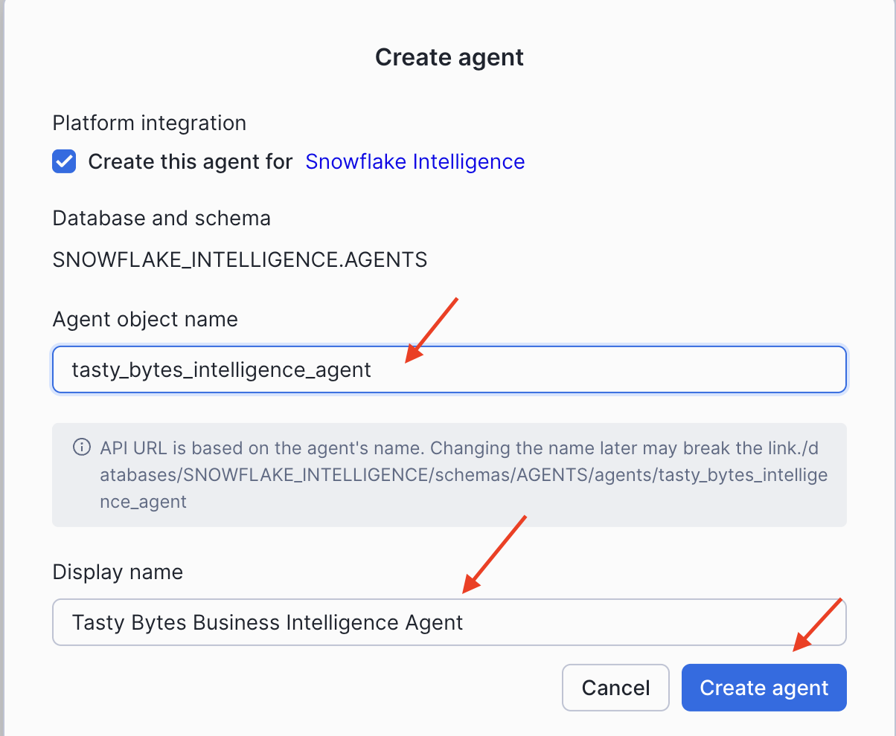

**エージェントの設定**

エージェントリストから名前をクリックして詳細ページを開き、**Edit** をクリックします。

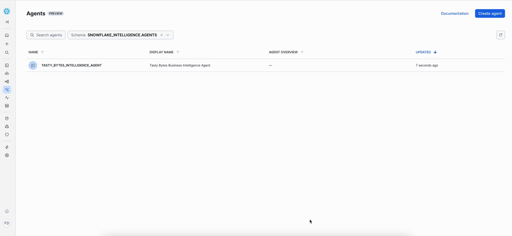

**1. About タブ**（JSON の `PROFILE` / `COMMENT` に相当）

Display name と Description を設定します。

**2. Tools タブ**（JSON の `tools` / `tool_resources` に相当）

*Cortex Analyst ツールの追加：* 「Cortex Analyst」の横の **Add** をクリックし、**Semantic view** を選択して `TB_101.SEMANTIC_LAYER` の `TASTY_BYTES_BUSINESS_ANALYTICS` を指定します。Warehouse に `TB_CORTEX_WH`、Query timeout に `300` を設定します。

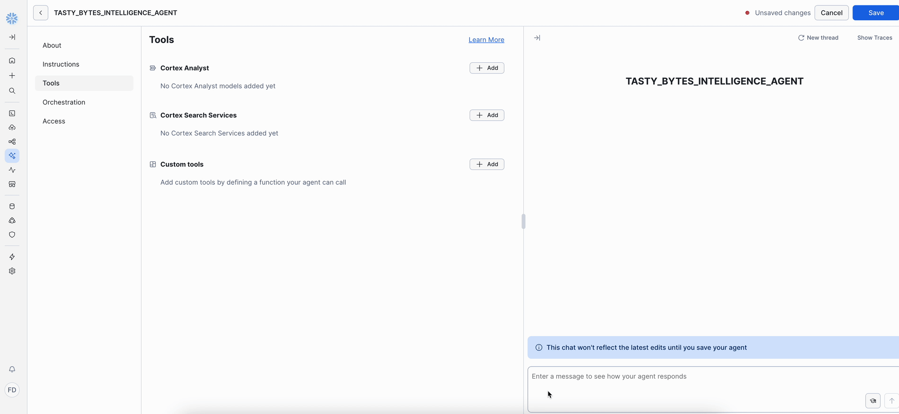

*Cortex Search Services ツールの追加：* 「Cortex Search Services」の横の **Add** をクリックし、Schema に `TB_101.HARMONIZED`、Search service に `TASTY_BYTES_REVIEW_SEARCH` を指定します。ID column に `REVIEW_ID`、Title column に `TRUCK_BRAND_NAME` を設定します。

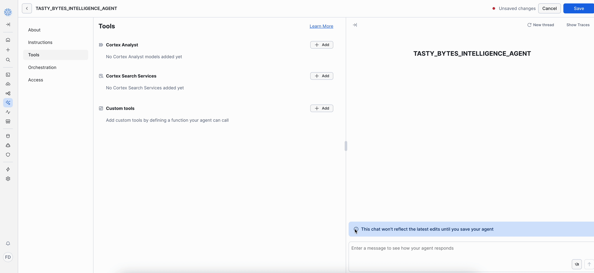

**3. Orchestration タブ**（JSON の `instructions.orchestration` / `instructions.response` に相当）

**4. Access タブ**（SQL の `GRANT USAGE ON AGENT` に相当）

**Add role** をクリックして `TB_DATA_ENGINEER` などのロールを追加します。

**5. 設定の保存** — 右上の **Save** をクリックします。

**参考：YAML セマンティックモデルファイルを使う場合**

本ハンズオンでは PART 2 で作成した Semantic View（スキーマオブジェクト）を使いますが、YAML ファイルをステージに置いて参照する方式もあります。その場合は Cortex Analyst 画面の **Upload your yaml file** から `TB_101.SEMANTIC_LAYER.SEMANTIC_MODEL_STAGE` にアップロードします。

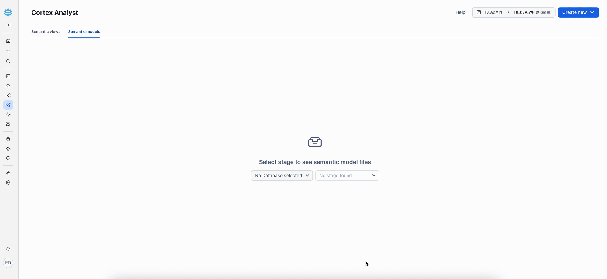

> **Semantic View と YAML ファイルの違い：** Semantic View は DDL で管理できるスキーマオブジェクトで、権限管理・バージョン管理が容易です。YAML ファイル方式は旧来の方法で、ステージ上のファイルとして管理します。本ハンズオンでは Semantic View を使います。

</details>

#### 3-3. UI（Snowflake CoWork）でテスト

1.  Snowsight の左側メニューから **AIとML** → **Snowflake CoWork** を開きます（環境によっては **Snowflake Intelligence** と表示されます）。
2.  エージェント選択で `TASTY_BYTES_BI_AGENT` を選びます。
3.  ロールが `TB_DATA_ENGINEER`（または `ACCOUNTADMIN`）になっていることを確認します。

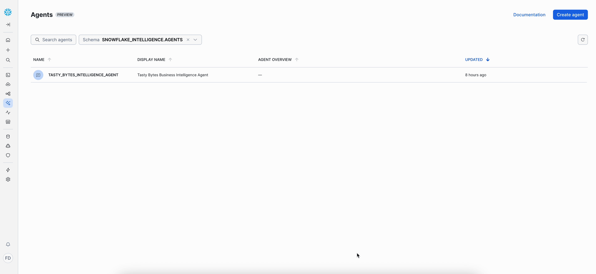

**プロンプト例 A — 単一ツールで回答できる質問**

まずエージェントが**正しくツールを選べるか**を確認します。

| プロンプト | 期待されるツール |
| --- | --- |
| `売上上位のトラックブランドを教えて` | Analyst のみ |
| `メニュータイプ別の売上を教えて` | Analyst のみ |
| `顧客はどんな不満を持っている？` | Search のみ |
| `食べ物が冷たかったというレビューを探して` | Search のみ |
| `接客に関する良い評価を見せて` | Search のみ |

**プロンプト例 B — 2 つのツールを組み合わせる質問（★エージェントの真価★）**

```
売上上位5都市を棒グラフで出して、それぞれの都市のレビューでよく話題になっている
トピックを3つずつ挙げてください
```

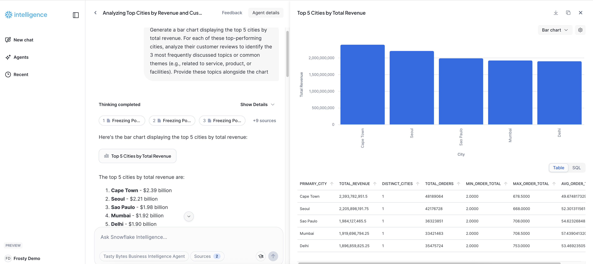

> **主要インサイト：** トップ都市の収益と、それらの都市の顧客が実際に言っていることをつなぎ合わせます。成功を真に推進しているもの、あるいは強い地域でも潜在的な問題が醸成されていないかについて、より豊かな理解が得られます。

```
売上が最も低い5都市を特定し、それぞれの都市のレビューから顧客の不満点を
3つずつ抽出して、都市・売上・不満点の表にしてください
```

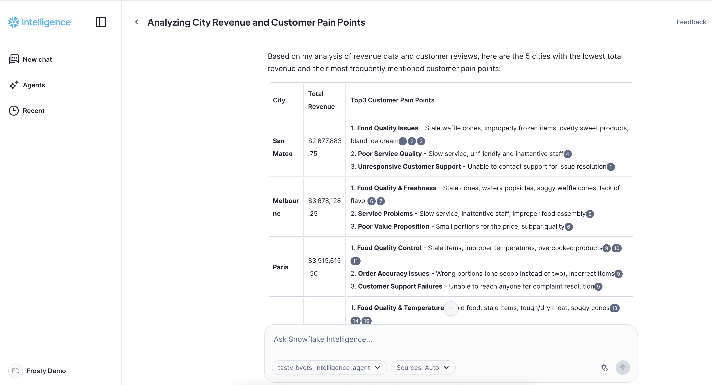

> **主要インサイト：** 生の収益数字と顧客レビューからの具体的なフィードバックを直接結びつけることで、サービス、製品、サポートを改善するために集中すべき場所を特定できます。

さらに踏み込んだ質問例です。

```
評価の低いレビューが多いトラックブランドの売上はどうなっている？
ラーメンのレビュー評価と売上に相関はある？
シアトルの顧客満足度と売上を他都市と比較して、改善提案をください
```

**観察のポイント**

* エージェントが**どのツールを使ったか**を回答の下部（ツール実行ログ）で確認する
* 組み合わせ質問では **Analyst → Search の順で 2 回ツールを呼んでいる**ことを確認する
* Analyst が生成した SQL を展開して、PART 2 で定義したメトリクスが使われているか確認する
* グラフ生成を依頼したときに可視化が返ることを確認する

#### まとめ

Tasty Bytes で経験したことは、ビジネスがデータを真に理解できる方法の根本的な変化を示しています。非構造化顧客フィードバックへの Cortex Search と、構造化ビジネス指標への Cortex Analyst を 1 つのエージェントに統合することで、真に統合されたビジネスインテリジェンスを実現しました。

すべての技術レベルのユーザーが自然言語で質問して、視覚的に豊かで実行可能な回答を即座に受け取れるようになりました。そして重要なのは、**この一連の AI 資産すべてを SQL（DDL）で定義した**という点です。つまり Git で管理し、レビューし、他の環境へ再現配布できます。これがデータエンジニアが AI 基盤を「運用可能な資産」として扱うための土台になります。

## （オプション）アプリとコラボレーション

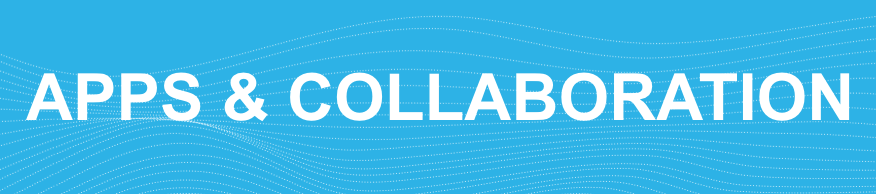

### 概要

このビネットでは、Snowflake マーケットプレイスを通じた Snowflake のシームレスなデータコラボレーションを探ります。ライブですぐにクエリできるサードパーティデータセットを取得し、従来の ETL パイプラインを必要とせずにすぐに内部データと結合して新しいインサイトを解放することがいかに簡単かを見ていきます。

### 学習内容
- Snowflake マーケットプレイスでデータを検索して取得する方法。
- ライブの共有データを即座にクエリする方法。
- マーケットプレイスのデータと自分のアカウントデータを結合して強化されたビューを作成する方法。
- より深い分析のためにサードパーティの POI（Point of Interest）データを活用する方法。
- 複雑なクエリを構造化するために CTE（Common Table Expression）を使用する方法。

### 構築するもの
- 内部売上データと外部の気象データおよび POI データを組み合わせた強化された分析ビュー。

### SQL コードを取得して SQL ファイルに貼り付けます。

> **★ このセクションは【オプション】です。** SWT ハンズオン（4 時間）の本編では時間の都合により扱いません。ご興味があればハンズオン後にご自身のペースでお試しください。

**この[ファイル](https://github.com/sfc-gh-kshimada/ZeroToSnowflake-SWT2026-JA/blob/main/scripts/vignette-5-OPTIONAL.sql)の SQL コードを新しい SQL ファイルにコピーして貼り付け、Snowflake で手順に沿って進めてください。**

### Snowflake マーケットプレイスからのデータ取得


#### 概要

アナリストの一人が天気がフードトラックの売上にどのように影響するかを確認したいと考えています。そのために、Snowflake マーケットプレイスを使って Weather Source からライブの気象データを取得し、自分たちの売上データと直接結合します。マーケットプレイスにより、データの複製や ETL なしに、サードパーティプロバイダーからライブですぐにクエリできるデータにアクセスできます。

> 
> **[Snowflake マーケットプレイスの概要](https://docs.snowflake.com/ja/user-guide/data-sharing-intro)**: マーケットプレイスは、さまざまなサードパーティデータ、アプリケーション、AI 製品を発見してアクセスするための集中型ハブを提供します。

#### ステップ 1 - 初期コンテキストの設定

まず、マーケットプレイスからデータを取得するために必要な `accountadmin` ロールを使用するようにコンテキストを設定します。

```sql
USE DATABASE tb_101;
USE ROLE accountadmin;
USE WAREHOUSE tb_de_wh;
```

#### ステップ 2 - Weather Source データの取得

Snowsight UI でこれらの手順に従って Weather Source データを取得します：

1.  `ACCOUNTADMIN` ロールを使用していることを確認します。
2.  左側ナビゲーションメニューから **Data Products** » **Marketplace** に移動します。
3.  検索バーに `Weather Source frostbyte` と入力します。
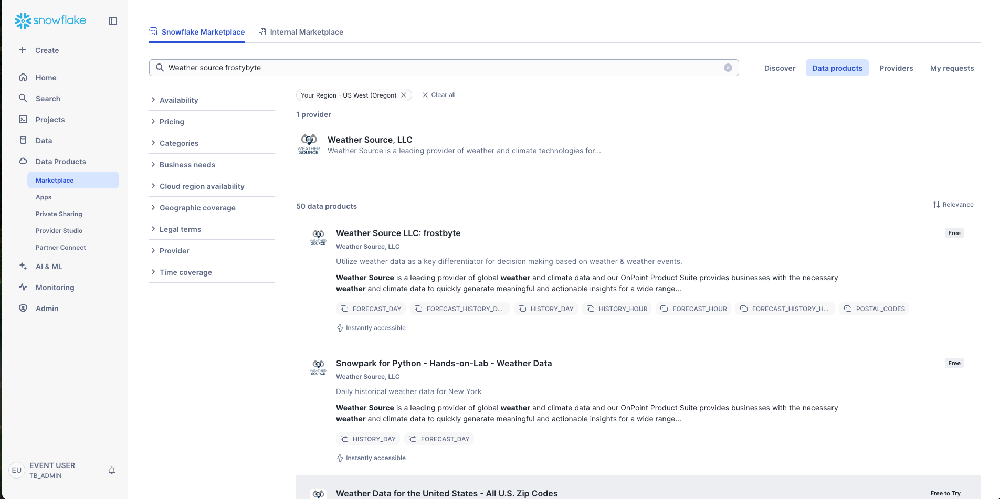

4.  **Weather Source LLC: frostbyte** リスティングをクリックします。
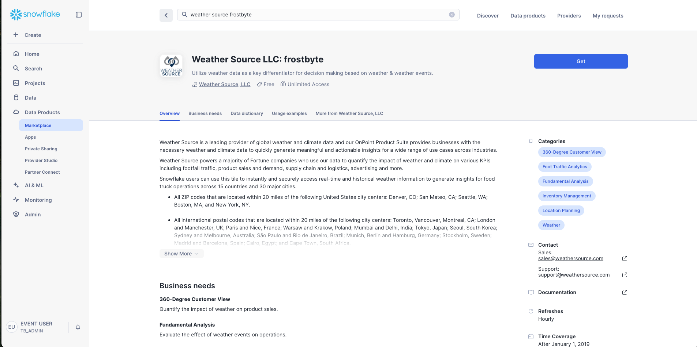

5.  **Get** ボタンをクリックします。
6.  Options を展開し、**Database name** を `ZTS_WEATHERSOURCE` に変更します。
7.  **PUBLIC** ロールへのアクセスを付与します。
8.  **Get** をクリックします。

このプロセスにより、Weather Source データが新しいデータベースとしてアカウントで即座に利用可能になり、クエリの準備ができます。

### アカウントデータと共有データの統合


#### 概要

Weather Source データがアカウントに入ったので、アナリストは既存の Tasty Bytes データとの結合をすぐに開始できます。ETL ジョブの完了を待つ必要はありません。

#### ステップ 1 - 共有データの探索

`tb_analyst` ロールに切り替えて新しい気象データの探索を始めましょう。まず、共有で利用可能なすべての US 都市のリストと、いくつかの平均気象指標を取得します。

```sql
USE ROLE tb_analyst;

SELECT 
    DISTINCT city_name,
    AVG(max_wind_speed_100m_mph) AS avg_wind_speed_mph,
    AVG(avg_temperature_air_2m_f) AS avg_temp_f,
    AVG(tot_precipitation_in) AS avg_precipitation_in,
    MAX(tot_snowfall_in) AS max_snowfall_in
FROM zts_weathersource.onpoint_id.history_day
WHERE country = 'US'
GROUP BY city_name;
```

#### ステップ 2 - 強化されたビューの作成

生の `country` データと Weather Source 共有の過去の日次気象データを結合するビューを作成しましょう。これにより、Tasty Bytes が営業している都市の気象指標の統合ビューが得られます。

```sql
CREATE OR REPLACE VIEW harmonized.daily_weather_v
COMMENT = 'Weather Source Daily History filtered to Tasty Bytes supported Cities'
    AS
SELECT
    hd.*,
    TO_VARCHAR(hd.date_valid_std, 'YYYY-MM') AS yyyy_mm,
    pc.city_name AS city,
    c.country AS country_desc
FROM zts_weathersource.onpoint_id.history_day hd
JOIN zts_weathersource.onpoint_id.postal_codes pc
    ON pc.postal_code = hd.postal_code
    AND pc.country = hd.country
JOIN raw_pos.country c
    ON c.iso_country = hd.country
    AND c.city = hd.city_name;
```

#### ステップ 3 - 強化されたデータの分析と可視化

新しいビューを使って、2022 年 2 月のドイツ・ハンブルクの平均日次気温をクエリします。以下のクエリを実行し、Snowsight で直接折れ線グラフとして可視化します。

```sql
SELECT
    dw.country_desc,
    dw.city_name,
    dw.date_valid_std,
    AVG(dw.avg_temperature_air_2m_f) AS average_temp_f
FROM harmonized.daily_weather_v dw
WHERE dw.country_desc = 'Germany'
    AND dw.city_name = 'Hamburg'
    AND YEAR(date_valid_std) = 2022
    AND MONTH(date_valid_std) = 2
GROUP BY dw.country_desc, dw.city_name, dw.date_valid_std
ORDER BY dw.date_valid_std DESC;
```

1.  上記のクエリを実行します。
2.  **Results** ペインで **Chart** をクリックします。
3.  **Chart Type** を `Line` に設定します。
4.  **X-Axis** を `DATE_VALID_STD` に設定します。
5.  **Y-Axis** を `AVERAGE_TEMP_F` に設定します。

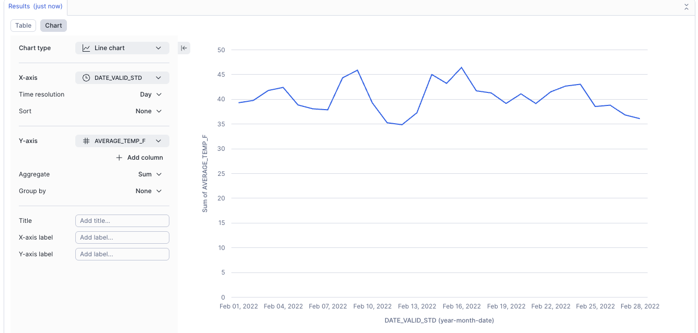

#### ステップ 4 - 売上と気象ビューの作成

さらに一歩進んで、`orders_v` ビューと新しい `daily_weather_v` を組み合わせ、売上が気象条件とどのように相関するかを確認しましょう。

```sql
CREATE OR REPLACE VIEW analytics.daily_sales_by_weather_v
COMMENT = 'Daily Weather Metrics and Orders Data'
AS
WITH daily_orders_aggregated AS (
    SELECT DATE(o.order_ts) AS order_date, o.primary_city, o.country,
        o.menu_item_name, SUM(o.price) AS total_sales
    FROM harmonized.orders_v o
    GROUP BY ALL
)
SELECT
    dw.date_valid_std AS date, dw.city_name, dw.country_desc,
    ZEROIFNULL(doa.total_sales) AS daily_sales, doa.menu_item_name,
    ROUND(dw.avg_temperature_air_2m_f, 2) AS avg_temp_fahrenheit,
    ROUND(dw.tot_precipitation_in, 2) AS avg_precipitation_inches,
    ROUND(dw.tot_snowdepth_in, 2) AS avg_snowdepth_inches,
    dw.max_wind_speed_100m_mph AS max_wind_speed_mph
FROM harmonized.daily_weather_v dw
LEFT JOIN daily_orders_aggregated doa
    ON dw.date_valid_std = doa.order_date
    AND dw.city_name = doa.primary_city
    AND dw.country_desc = doa.country
ORDER BY date ASC;
```

#### ステップ 5 - ビジネスの問いに答える

アナリストは「シアトル市場で大雨が売上数字にどのような影響を与えるか？」などの複雑なビジネスの問いに答えられるようになりました。

```sql
SELECT * EXCLUDE (city_name, country_desc, avg_snowdepth_inches, max_wind_speed_mph)
FROM analytics.daily_sales_by_weather_v
WHERE 
    country_desc = 'United States'
    AND city_name = 'Seattle'
    AND avg_precipitation_inches >= 1.0
ORDER BY date ASC;
```

Snowsight で再び結果を可視化しましょう。今度は棒グラフにします。

1.  上記のクエリを実行します。
2.  **Results** ペインで **Chart** をクリックします。
3.  **Chart Type** を `Bar` に設定します。
4.  **X-Axis** を `MENU_ITEM_NAME` に設定します。
5.  **Y-Axis** を `DAILY_SALES` に設定します。

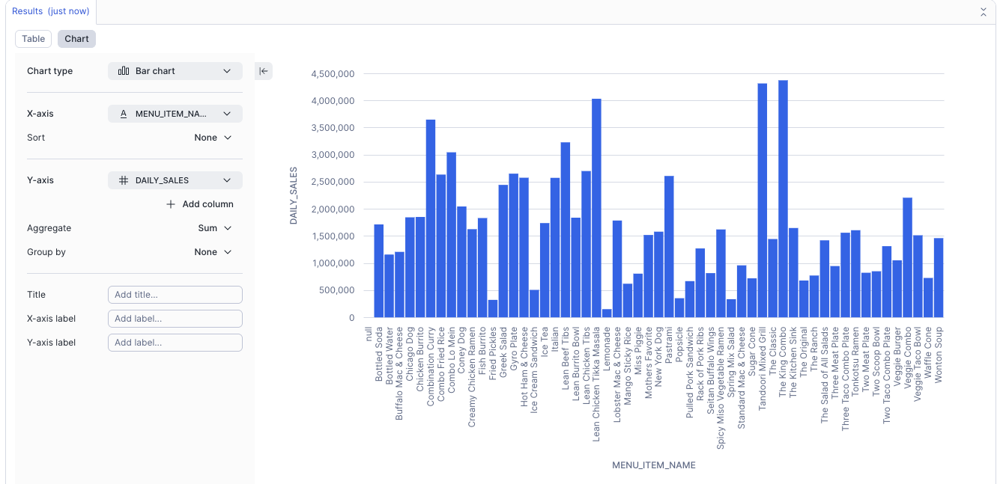

### POI データの探索


#### 概要

アナリストはフードトラックの具体的な場所についてより多くのインサイトを得たいと考えています。Snowflake マーケットプレイスの別プロバイダー Safegraph から POI（Point of Interest）データを取得して、分析をさらに強化できます。

#### ステップ 1 - Safegraph POI データの取得

マーケットプレイスから Safegraph データを取得するには、前と同じ手順に従います。

1.  `ACCOUNTADMIN` ロールを使用していることを確認します。
2.  **Data Products** » **Marketplace** に移動します。
3.  検索バーに `safegraph frostbyte` と入力します。

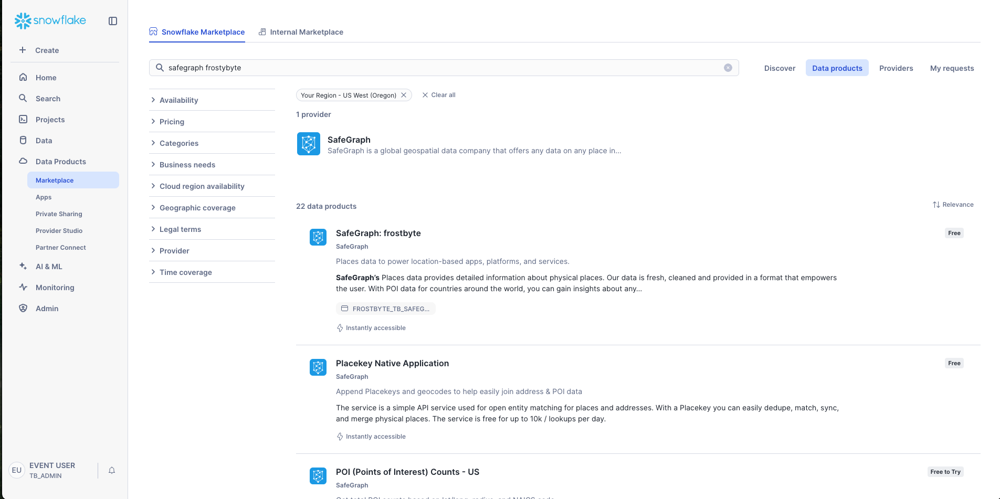

4.  **Safegraph: frostbyte** リスティングを選択して **Get** をクリックします。
5.  Options を展開し、**Database name** を `ZTS_SAFEGRAPH` に設定します。
6.  **PUBLIC** ロールへのアクセスを付与します。
7.  **Get** をクリックします。

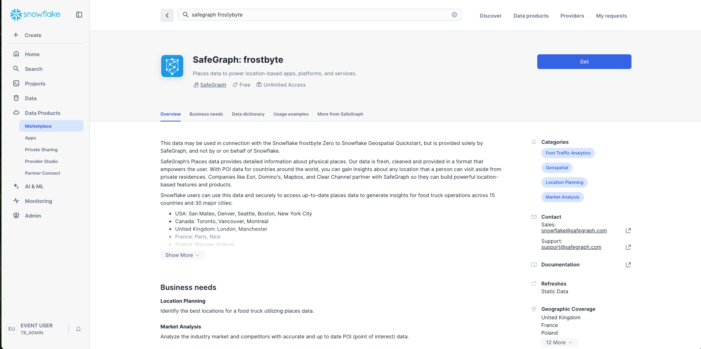

#### ステップ 2 - POI ビューの作成

内部の `location` データと Safegraph POI データを結合するビューを作成しましょう。

```sql
CREATE OR REPLACE VIEW harmonized.tastybytes_poi_v
AS 
SELECT 
    l.location_id, sg.postal_code, sg.country, sg.city, sg.iso_country_code,
    sg.location_name, sg.top_category, sg.category_tags,
    sg.includes_parking_lot, sg.open_hours
FROM raw_pos.location l
JOIN zts_safegraph.public.frostbyte_tb_safegraph_s sg 
    ON l.location_id = sg.location_id
    AND l.iso_country_code = sg.iso_country_code;
```

#### ステップ 3 - POI データと気象データの組み合わせ

これで 3 つのデータセット（内部データ、気象データ、POI データ）をすべて組み合わせることができます。2022 年の US で最も風の強いトラックの場所トップ 3 を見つけましょう。

```sql
SELECT TOP 3
    p.location_id, p.city, p.postal_code,
    AVG(hd.max_wind_speed_100m_mph) AS average_wind_speed
FROM harmonized.tastybytes_poi_v AS p
JOIN zts_weathersource.onpoint_id.history_day AS hd
    ON p.postal_code = hd.postal_code
WHERE
    p.country = 'United States'
    AND YEAR(hd.date_valid_std) = 2022
GROUP BY p.location_id, p.city, p.postal_code
ORDER BY average_wind_speed DESC;
```

#### ステップ 4 - 気象への耐性によるブランド分析

最後に、ブランドの耐性を判断するためのより複雑な分析を行います。CTE を使って最も風の強い場所を先に見つけ、それらの場所での「穏やかな日」と「風の強い日」の各トラックブランドの売上を比較します。これは、耐性の低いブランドに「風の強い日」プロモーションを提供するなどの運用上の意思決定に役立てることができます。

```sql
WITH TopWindiestLocations AS (
    SELECT TOP 3
        p.location_id
    FROM harmonized.tastybytes_poi_v AS p
    JOIN zts_weathersource.onpoint_id.history_day AS hd ON p.postal_code = hd.postal_code
    WHERE p.country = 'United States' AND YEAR(hd.date_valid_std) = 2022
    GROUP BY p.location_id, p.city, p.postal_code
    ORDER BY AVG(hd.max_wind_speed_100m_mph) DESC
)
SELECT
    o.truck_brand_name,
    ROUND(AVG(CASE WHEN hd.max_wind_speed_100m_mph <= 20 THEN o.order_total END), 2) AS avg_sales_calm_days,
    ZEROIFNULL(ROUND(AVG(CASE WHEN hd.max_wind_speed_100m_mph > 20 THEN o.order_total END), 2)) AS avg_sales_windy_days
FROM analytics.orders_v AS o
JOIN zts_weathersource.onpoint_id.history_day AS hd
    ON o.primary_city = hd.city_name AND DATE(o.order_ts) = hd.date_valid_std
WHERE o.location_id IN (SELECT location_id FROM TopWindiestLocations)
GROUP BY o.truck_brand_name
ORDER BY o.truck_brand_name;
```

### Streamlit in Snowflake の紹介


Streamlit は、機械学習とデータサイエンスのウェブアプリケーションを簡単に作成・共有するために設計されたオープンソースの Python ライブラリです。データ駆動型アプリの迅速な開発と展開を可能にします。

Streamlit in Snowflake は、開発者が Snowflake 内で直接アプリケーションを安全に構築、展開、共有できるようにします。この統合により、データや Application コードを外部システムに移動させることなく、Snowflake に保存されたデータを処理・利用するアプリを構築できます。
***
#### ステップ 1 - Streamlit アプリの作成
**2022 年 2 月の日本での各メニュー項目の売上データを表示・グラフ化する最初の Streamlit アプリを作成しましょう。**

1. まず、**Projects** » **Streamlit** に移動し、右上の青い「+ Streamlit App」ボタンをクリックして新しいアプリを作成します。

2. 「Create Streamlit App」ポップアップにこれらの値を入力します：
    - App title: Menu Item Sales
    - App location:
        - Database: tb_101
        - Schema: Analytics
    - App warehouse: tb_dev_wh
3. 「Create」をクリックします。
アプリが最初に読み込まれると、右ペインにサンプルアプリが表示され、左側のエディタペインにアプリのコードが表示されます。

4. すべてのコードを選択して削除します。
5. **次に、この[コード](https://github.com/sfc-gh-kshimada/ZeroToSnowflake-SWT2026-JA/blob/main/streamlit_apps/jp_sales_dashboard.py)を空のエディタウィンドウにコピー＆ペーストし、右上の「Run」をクリックします。**

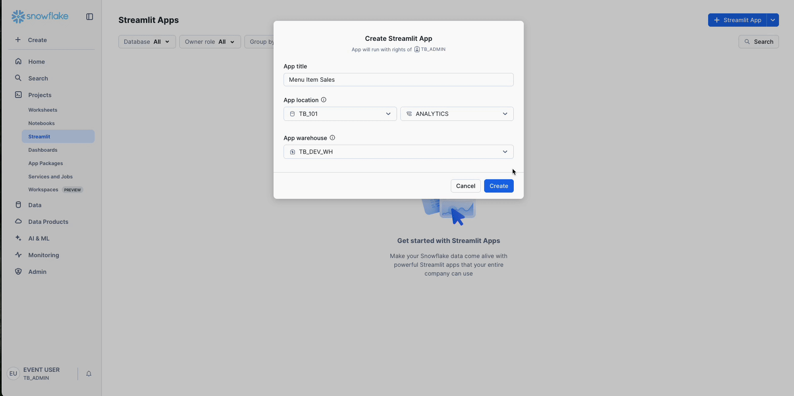

## まとめとリソース

#### 概要

おめでとうございます！Tasty Bytes - Zero to Snowflake の旅を無事完了しました。

ウェアハウスの構築と設定、データのクローンと変換、タイムトラベルによるドロップされたテーブルの復元、半構造化データの自動化データパイプラインの構築をすべて達成しました。また、シンプルな AISQL 関数で分析を生成し、Snowflake Copilot でワークフローを加速することで AI を使ってインサイトを解き放ちました。さらに、ロールとポリシーを使った堅牢なガバナンスフレームワークを実装し、Snowflake マーケットプレイスからのライブデータセットで自分のデータをシームレスに強化しました。

このクイックスタートを再実行したい場合は、SQL ファイルの最下部にある完全な `RESET` スクリプトを実行してください。

#### 学習内容のまとめ
- **ウェアハウスとパフォーマンス：** 仮想ウェアハウスの作成、管理、スケーリング方法、および Snowflake の結果キャッシュの活用方法。
- **データ変換：** 安全な開発のためのゼロコピークローニング、データの変換、タイムトラベルと `UNDROP` を使ったエラーからの即座の復元方法。
- **データパイプライン：** 外部ステージからのデータ取り込み、半構造化 `VARIANT` データの処理、ダイナミックテーブルを使った自動化 ELT パイプラインの構築方法。
- **Snowflake Cortex AI：** 顧客分析プラットフォームの構築のために Snowflake Cortex AI を活用する方法。
- **データガバナンス：** ロールベースのアクセス制御、自動化 PII 分類、タグベースのデータマスキング、行アクセスポリシーを使ったセキュリティフレームワークの実装方法。
- **データコラボレーション：** Snowflake マーケットプレイスからライブのサードパーティデータセットを発見・取得し、自分のデータとシームレスに結合して新しいインサイトを生成する方法。

#### リソース
- [仮想ウェアハウスと設定](https://docs.snowflake.com/ja/user-guide/warehouses-overview)
- [リソースモニター](https://docs.snowflake.com/ja/user-guide/resource-monitors)
- [バジェット](https://docs.snowflake.com/ja/user-guide/budgets)
- [ユニバーサルサーチ](https://docs.snowflake.com/ja/user-guide/ui-snowsight-universal-search)
- [外部ステージからの取り込み](https://docs.snowflake.com/ja/sql-reference/sql/copy-into-table)
- [半構造化データ](https://docs.snowflake.com/ja/sql-reference/data-types-semistructured)
- [ダイナミックテーブル](https://docs.snowflake.com/ja/user-guide/dynamic-tables-about)
- [ロールとアクセス制御](https://docs.snowflake.com/ja/user-guide/security-access-control-overview)
- [タグベースの分類](https://docs.snowflake.com/ja/user-guide/classify-auto)
- [マスキングポリシーによるカラムレベルセキュリティ](https://docs.snowflake.com/ja/user-guide/security-column-intro)
- [行アクセスポリシーによる行レベルセキュリティ](https://docs.snowflake.com/ja/user-guide/security-row-intro)
- [データメトリック関数](https://docs.snowflake.com/ja/user-guide/data-quality-intro)
- [トラストセンター](https://docs.snowflake.com/ja/user-guide/trust-center/overview)
- [データ共有](https://docs.snowflake.com/ja/user-guide/data-sharing-intro)
- [Snowflake Cortex の AI SQL 関数](https://docs.snowflake.com/ja/user-guide/snowflake-cortex/aisql)
- [Snowflake Cortex Search の概要](https://docs.snowflake.com/ja/user-guide/snowflake-cortex/cortex-search/cortex-search-overview)
- [Snowflake Cortex Analyst](https://docs.snowflake.com/ja/user-guide/snowflake-cortex/cortex-analyst)
